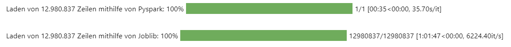
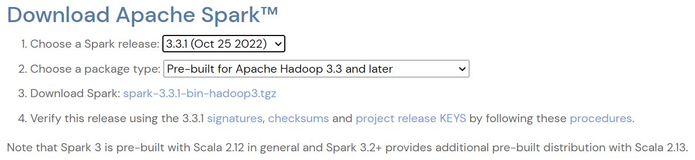

# Beschleunigung mithilfe von PySpark
PySpark wurde von den Entwicklern des Big-Data-Systems Apache Spark herausgebracht und ist eine Version, welche in der Python Programmierung Anwendung findet. Die Architektur verteilt sich auf ein Cluster, wodurch es ermöglicht wird große Datenmengen zu parallelisieren und performanter zu verarbeiten. Hierfür wird auf den Arbeitsspeicher der Hardware zugegriffen wodurch die Festplatte nicht belastet wird (Wuttke, Einführung in Apache Spark: Komponenten, Vorteile und Anwendungsbereiche, 2022). Es gilt als eines der besten Frameworks in der Datenwissenschaft und verbindet Big Data mit maschinellem Lernen, da es sowohl In-Memory-Operationen für eine bis zu 100-fache Beschleunigung liefert als auch Zusatzpakete wie MLib und GraphX bietet. Spark läuft auf einer Virtuellen Maschine von Java (JVM), ist in Scala geschrieben und auf Hadoop/HDFS implementiert. PySpark ist die Python-API, welche eine Schnittstelle zwischen der Python-Programmierung und dem Spark-Framework liefert. Auf diese Weise ist es möglich mithilfe von Objekten die Vorteile von Spark zu nutzen, ohne die Programmiersprache Scala zu erlernen (Sarkar, 2018).

Im Rahmen dieser Masterarbeit wurde versucht die Prozesse der Textverarbeitung mithilfe von Pyspark zu beschleunigen. Es wurde zu Veranschaulichungszwecken der große Datensatz zu den Amazon Daten von "Sport and Outdoors" verwendet.
Der gesammte Code ist in diese [Jupyter Notebook](Dataanalysis_and_Preperation_Pyspark.jpynb) zu finden.

<center></center>
<p align="center">Vergleich der Beschleunigungen von PySpark gegenüber Joblib</p>

Die Beschleunigung durch die Verwendung von PySpark ist, wie in der Abbildung zu sehen, beachtlich. Während das Laden ohne Beschleunigung nach über 1,5 Stunden abgebrochen wurde und die Parallelisierung durch Joblib ca. 1h lädt, dauert der Ladevorgang mit der Implementierung von PySpark lediglich 35 Sekunden. Daraus ergibt sich eine Beschleunigung von mindesten 800-facher Geschwindigkeit. Trotz diese überragenden Ergebnisse konnte PySpark nicht weiter verwendet werden, da aufgrund der Limitierungen der externen Verwendung von PySpark (auserhalb von Databricks) bei dem Export und der Transformation des DataFrames zu einer Liste das "maximumPassResult" überschritten wurde. Dies kann bei einer lokalen Verwendung von PySpark leider nicht angepasst werden.


## Implementierung in Jupyter Notebook

Um mit Apache Spark in Juyter Notebooks arbeiten zu können, muss die richtige Version zuerst heruntergeladen werden. Hierfür kann auf der Webside von [Apache Spark](https://spark.apache.org/downloads.html) die richtige Version heruntergeladen werden. In Abbildung sechs sind die notwendigen Konfigurationen ersichtlich (Apache Spark, 2023).

<center></center>
<p align="center">Herunterladen von Spark 3.3.1 (Apache Spark, 2023)</p>

Nun kann die Library über den „pip install“ Befehl oder über das Terminal installiert werden. In diesem Fall hat die Installation über das Terminal stattgefunden. Nach der erfolgreichen Installation von pyspark können die für die Beschleunigung des Ladevorgang benötigten Klassen importiert werden. Wichtig ist jedoch, dass zuvor „findspark“ importiert und initialisiert wurde, damit die benötigte Spark Instanz gewunden wird (Shah, 2018).

```
# Import findspark
import findspark
findspark.init()
```
```
# Importieren Pyspark
import pyspark
from pyspark.sql import SparkSession
```
Nach dem Erfolgreichen Abschluss aller Installationen und Imports, kann als nächstes eine Spark Session mit folgendem Befehl gestartet werden (Shah, 2018):

```
# Spark Session starten
spark = SparkSession.builder.getOrCreate()
```

Bei einem ersten Versuch die Spark Session zu starten kam es im Rahmen dieser Masterarbeit jedoch zu folgender Fehlermeldung:

 > <u>RuntimeError:</u> Java gateway process exited before sending its port number

Um diese Fehlermeldung zu beheben, war es erforderlich Java (JDK) zu installieren. Benötigt wird die Version 8, damit Python in der Lage ist mit der Virtuellen Maschine von Java zu kommunizieren (Preusler, 2020). Der [Java Download (JDK)](https://www.java.com/download/ie_manual.jsp) kann direkt über die Website von Oracle abgerufen werden (Oracle, 2023).

Nach dem Download befindet sich die Datei „JavaSetup8u351.exe“ im Download Ordner. Diese muss lediglich in den aktuellen Arbeitsordner kopiert werden. Es ist wichtig, dass sich die Downloads von Spark und Java in dem gleichen Ordner befinden, in welchem das Jupyter Notebook abgelegt ist, damit das Coding fehlerfrei läuft. Nach den genannten Korrekturen konnte die Spark Session erfolgreich gestartet werden:
```
Spark Session gestartet
        SparkSession - in-memory
        SparkContext
        Spark UI
        Version	v3.3.1
        Master	local[*]
        AppName	pyspark-shell
```


## Laden der Daten mithilfe von PySpark

Der Datensatz lässt sich nun mit der unten stehenden Funktion in einen Data Frame laden. Die Methode „format“ dient dazu die Quelle der Daten weiter zu spezifizieren. (SparkBy{Examples}, 2020). Beispielhaft wurde auch hier der Datensatz zur Sport und Outdoorbekleidung gewählt.
```
# Laden des Datensatzes in einen DataFrame
df = spark.read.format('org.apache.spark.sql.json') \
        .load("Sports_and_Outdoors.json")
```
Während der Masterarbeit kahm es hier zu einer weiteren Fehlermeldung, da Duplikate in den Spaltennamen vorhanden sind. Dies ist der Fall, da mehrere Spalten mit dem Wort „style“ beginnen.
Um diesen Fehler zu umgehen, kann die Spark Session konfiguriert werden, indem die Berücksichtigung der Groß- und Kleinschreibung aktiviert wird (shoeboxer, 2015):
```
# Konfiguration "Case Sensitive" zur Normalisierung
spark.conf.set("spark.sql.caseSensitive", "true")
```


## Literatur

Apache Spark. (17. 02 2023). Download Apache Spark™. Abgerufen am 20. 02 2023 von spark.apache.org: https://spark.apache.org/downloads.html

Oracle. (17. 01 2023). Download Java for Windows. Abgerufen am 20. 02 2023 von java.com: https://www.java.com/download/ie_manual.jsp

Preusler, S. (13. 03 2020). Pyspark und Jupyter Notebook Anleitung für Windows. Abgerufen am 14. 01 2023 von https://medium.com/@stefan.preusler/pyspark-und-jupyter-notebook-anleitung-f%C3%BCr-windows-7317f2c968c4

shoeboxer. (2015, 11 20). Duplicate columns in Spark Dataframe. Retrieved 02 20, 2023, from stackoverflow.com: https://stackoverflow.com/questions/33816481/duplicate-columns-in-spark-dataframe

Shah, A., 2018. How to setup Apache Spark(PySpark) on Jupyter/IPython Notebook?. [Online] 
Available at: https://medium.com/@ashish1512/how-to-setup-apache-spark-pyspark-on-jupyter-ipython-notebook-3330543ab307
[Accessed 14 01 2023].

Sarkar, T. (12. 11 2018). How to set up PySpark for your Jupyter notebook. Abgerufen am 14. 01 2023 von opensource.com: https://opensource.com/article/18/11/pyspark-jupyter-notebook

SparkBy{Examples}. (06. 12 2020). PySpark Liest JSON-Datei in DataFrame. Abgerufen am 14. 01 2023 von https://sparkbyexamples.com/pyspark/pyspark-read-json-file-into-dataframe/#read-json-multiline

Wuttke, L. (2022). Einführung in Apache Spark: Komponenten, Vorteile und Anwendungsbereiche. Abgerufen am 05. 01 2023 von datasolut.com: https://datasolut.com/was-ist-spark/#was-ist-pyspark
