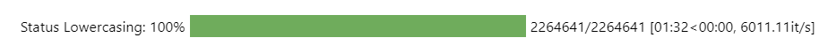

# Datapreperation
Dieses Notebook umfasst die Datenvorverarbeitung der Textdaten, da die Topic Modelling Modelle des Machine und Deep Learning ausschließlich numerische Daten verarbeiten können. Es werden alle nicht relevanten Informationen vereinheitlicht oder aus dem Datensatz entgernt, damit diese später in ein berechenbares Format konvertiert werden können und untenstehender Datensatz erzeugt wird. Im Rahmen dieser Masterarbeit wurde die Datapreparation anhand des kleinen Datensatz der Kategorie ["Sports and Outdoors" der Amazon Daten](https://nijianmo.github.io/amazon/index.html) durchgeführt.

<Br>

### Bild

<Br>


Die Preparation gliedert sich in zwei Kathegorien, die allgemeinen Bereinigungsschritte und die Bereinigung der Textdaten:

<ul>1. Allgemeine Datenbereinigung</ul>
    <ul>
     <ul>1.1. Selectieren und Zusammenführen der Spalten</ul>
     <ul>1.2. Nan-Values und doppelte Werte</ul>
     <ul>1.3. Löschen zu kurzer Reviews</ul>
     <ul>1.4. Selectieren der Jahre 2011 bis 2018</ul>
    </ul>
<ul>2. Bereinigung der Textdaten</ul>
    <ul>
     <ul>2.1. Lowercasing</ul>
     <ul>2.2. Lemmatisierung</ul>
     <ul>2.3. Stemming</ul>
     <ul>2.4. Entfernung von Satzzeichen</ul>
     <ul>2.5. Entfernung von Stopwords</ul>
     <ul>2.6. Entfernung von Zahlen</ul>
     <ul>2.7. Entfernung von nicht ASCII konformen Wörtern</ul>
    </ul>

<Br>

## Wichtigste Schritte der Datapreparation
Die Implementierung der Bereinigungsschritte sind dem Jupyter Notebook zu entnehmen. Im folgenden sind die wichtigsten Funktionen zusammengefasst. Diese lassen sich auf unterschiedliche weiße in eine Pipeline integrieren. Im Rahmen dieser Masterarbeit wurden sie mithilfe einer For-Schleife und der Beschleunigung durch Joblib durchgeführt. Die Beschleunigung zeigte bei dem verkleinerten Datensatz zu ["Sports and Outdoors"](https://nijianmo.github.io/amazon/index.html) mit über 2 Mio. Zeilen gute Ergebnisse. Bei der Verarbeitung größerer Textmengen erhöhen sich Laufzeit rapiede. Aus diesem Grund lohnt sich die Implementierung mit PySpark, welche [hier](https://github.com/Sannui/Masterarbeit_Nuissl_Sandra/tree/main/Beschleunigung%20mit%20PySpark) beschrieben wurde.


<Br>

### Lowercasing

Das Lowercasing beschäftigt sich mit der Groß- und Kleinschreibung in TExten. Da es für das Verständnis eines Textes bzw. der Wörter keiner Groß- und Kleinschreibung bedarf, kann der Datensatz in diesem Punkt vereinheitlicht werden(Pomer, 2022). 

```
# Konvertierung der Groß- und Kleinschreibung
def to_lower(in_string):
    out_string = in_string.lower()
    return out_string
```

<p align="left"></p>

<Br>


### Lemmatisierung

Unter Lemmatisierung wird die Umwandlung von gramatikalischen Merkmale in ihre Grundform verstanden, wodurch sich die Anzahl der Flexionsformen verringert (Pomer, 2022). Auf diese Weiße lassen sich Zukunts- und Vergangenheitsformen in die Gegenwardsform umwandeln und Pluralformen in den Singular konvertieren (Yuzhe-Lu, 2018).

```
# Überführen der Wörter in ihre Grundform
def lemmatize(in_string):
    # Definition der notwendigen Parameter
    list_pos = 0                                  # Zuordnung einer Positionsnummer
    cleaned_str = ''                              # Leerer String für bereinigte Wörter
    text_token = nltk.word_tokenize(in_string)    # Tokenisieren der Sätze in einzelne Strings
    tagged_words = pos_tag(text_token)            # Grammatikalisches Tagging
    wnl = WordNetLemmatizer()                     # Klasse von NLTK für Lemmatisierung

    # Durchfürhung der Lemmatisation und Zusammenführung der Ergebnisse in einen String
    for word in tagged_words:
        if 'v' in word[1].lower():
            lemma = wnl.lemmatize(word[0], pos='v')
        else:
            lemma = wnl.lemmatize(word[0], pos='n')
        if list_pos == 0:
            cleaned_str = lemma
        else:
            cleaned_str = cleaned_str + ' ' + lemma
        list_pos += 1
    return cleaned_str
```

<p align="left"></p>

<Br>


### Stemming

Das Stemming ist ebenfalls eine Methode der Vereinheitlichung grammatikalischer Formen und gleicht die Nachteile der Lemmatisierung aus. Auf Wörter deren Grundform nicht durch das entfernen der Suffixe und Präfixe gebildet werden kann, können die Verkürzungsregeln der Stemming Algorithmen angewendet werden. Dies ist beispielsweise bei unregelmäßigen Verben oder Steigerungsformen der Fall (Luber & Litzel, Was ist Stemming?, 2020). 


```
# Durchfürhung der Verkürzungsregeln
def stemming(in_string):
    # Definition der notwendigen Parameter
    text_token = nltk.word_tokenize(in_string)      # Tokenisieren der Sätze in einzelne Strings
    stemmer = SnowballStemmer("english")            # Laden der Klasse zum Stemming

    # Durchfürhung des Stemmings und Zusammenführung der Ergebnisse in einen String
    cleaned_str = ' '.join([stemmer.stem(word) for word in text_token])
    return cleaned_str
```

<p align="left"></p>

<Br>


### Entfernung von Satzzeichen

Ein weiterer Schritt der Datenbereinigung bei Textdaten ist die Entfernung von Satzzeichen. Hier ist zu beachten, dass diese nicht ohne Weiteres entfernt werden können. Auf der einen Seite gibt es eine Reihe von Zeichen wie Klammern oder Punkte, welche den Inhalt und Kontext eines Datensatzes nicht maßgeblich beeinträchtigen. Daher lassen sich diese ohne Weiteres entfernen. Anders verhält es sich jedoch bei Kommata und Fragezeichen. Hierbei beeinflusst das Satzzeichen den Inhalt und kann daher die Analyse verfälschen. Sind im Datensatz viele Zahlen vorhanden, müssen die Kommata genauer untersucht werden, um zu vermeiden, dass aus einem Geldwert von 19,98 plötzlich das Jahr 1998 wird. Beide Zahlen hätten bei der Entfernung des Kommas den gleichen Wert und keine Aussagekraft (Pomer, 2022). Aus diesem Grund soll im Folgenden mit diesem Wissen im Hinterkopf eine Bereinigung der Satzzeichen stattfinden. Treten bei dem Ergebnis der Analyse vermehrt Zahlen oder andere Unstimmigkeiten auf, müssen die Satzzeichen ggf. in die Modelle miteinbezogen werden.

` !"#$%&\'()*+,-./:;<=>?@[\\]^_{|}~ `

```
def punctation(in_string):
    cleaned_string = in_string.translate(str.maketrans("","",string.punctuation))
    return cleaned_string
```

<p align="left"></p>

<Br>


### Entfernung von Stopwords

Stoppwörter sind Wörter, welche sehr häufig in einem Text auftreten und einen Einfluss auf die Grammatik eines Satzes haben (Pomer, 2022), für gewöhnlich diesem jedoch keine Bedeutung verleihen. Aus diesem Grund können Stoppwörter für eine Topic Modelling Analyse herausgefiltert werden, ohne dass der Kontext verändert wird. Auf diesen Weg lässt sich der Textkorpus um unerwünschte Wörter reduzieren, welche keinerlei Informationen für die Topic Modelling Modelle liefern. Des Weiteren lässt sich durch die Reduktion, die Trainingszeit des Modells reduzieren und die Clustering Genauigkeit steigern. Es ist jedoch zu beachten, dass die Auswahl der zu entfernenden Stopwords mit Bedacht getroffen werden muss, da beispielsweise eine Negation eine entscheidende Information liefert und bei dessen Entfernung den Sinn des Satzes verfälschen würde (Teja, 2020). Für jede Sprache existieren unterschiedliche Stoppwörter. Um diese aus den Daten herauszufiltern werden sogenannte Stopwordlisten herangezogen (Pomer, 2022).

```

```


<Br>


### Entfernung von Zahlen

Wie bei jeder Bereinigung im Rahmen der Data Preperation muss eine Abwägung stattfinden, ob der Anwendungsfall die Informationen benötigt oder ob der Datensatz verringert werden kann (Pomer, 2022). Im Fall des Amazondatensatzes werden die Zahlen aus dem Text entnommen, da die Annahme getroffen wird, dass die Nummern nicht die Zuordnung in Kategorien unterstützen. Zur Entfernung der Nummern wird eine Funktion definiert, welche zuerst mithilfe der Library „Regular expression“ die Nummern in der Variable „num_re“ speichert (Python Software Foundation, 2023). Diese werden dann iterativ mit dem Satz abgeglichen und durch nichts ersetzt, falls es zu einer Übereinstimmung kommt (Pomer, 2022).

```

```


<Br>


### Entfernung von nicht ASCII konformen Wörtern

ASCII ist die Abkürzung für „American Standard Code for Information Interchange“ und es ist hierunter eine standardisierte Darstellungsform zu verstehen, mit welcher sich Zeichen durch ein elektronisches Gerät darstellen lassen. Über einen siebenstelligen Binärcode aus Einsen und Nullen lässt sich jedes dieser Zeichen erzeugen (IONOS SE, 2022). Da es sich hierbei um einen rein amerikanischen Standard handelt, werden Umlaute wie „ä, ö, ü“ oder weitere Sonderbuchstaben wie „ß“ oder „é, á“ nicht berücksichtigt. Würde der Datensatz beispielsweise deutsche Sätze enthalten, ist es wichtig, diese Umlaute zu normalisieren, da diese sonst einfach aus dem Datensatz gelöscht werden und die Bedeutung der Wörter verfälscht (Pomer, 2022). Da der Amazondatensatz, wie sich aus der Analyse ergab, lediglich englische Texte enthält, kann im Rahmen dieser Masterarbeit auf eine Bereinigung der Umlaute verzichtet werden, ohne dass die Modelle an Aussagekraft einbüßen. Zur Bereinigung von ASCII-Zeichen, wird folgende Formel definiert.

```

```

