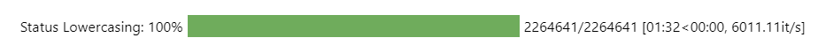
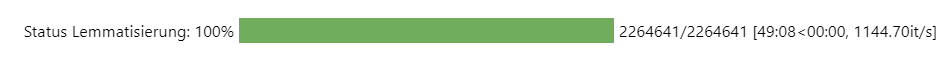
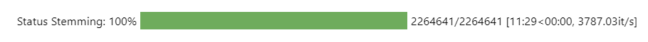
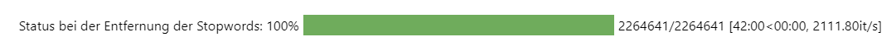
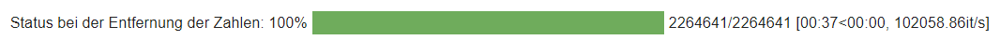
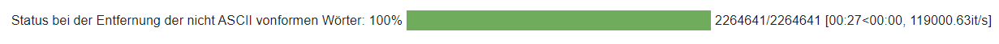

# Datapreperation
Dieses Notebook umfasst die Datenvorverarbeitung der Textdaten, da die Topic Modelling Modelle des Machine und Deep Learning ausschließlich numerische Daten verarbeiten können. Es werden alle nicht relevanten Informationen vereinheitlicht oder aus dem Datensatz entgernt, damit diese später in ein berechenbares Format konvertiert werden können und untenstehender Datensatz erzeugt wird. Im Rahmen dieser Masterarbeit wurde die Datapreparation anhand des kleinen Datensatz der Kategorie ["Sports and Outdoors" der Amazon Daten](https://nijianmo.github.io/amazon/index.html) durchgeführt.

<Br>

<p align="center"></p>
<p align="center>Fertig bereinigter Datensatz</p>

<Br>


Die Preparation gliedert sich in zwei Kathegorien, die allgemeinen Bereinigungsschritte und die Bereinigung der Textdaten:

<ul>1. Allgemeine Datenbereinigung</ul>
    <ul>
     <ul>1.1. Selectieren und Zusammenführen der Spalten</ul>
     <ul>1.2. Nan-Values und doppelte Werte</ul>
     <ul>1.3. Löschen zu kurzer Reviews</ul>
     <ul>1.4. Selectieren der Jahre 2011 bis 2018</ul>
    </ul>
<ul>2. Bereinigung der Textdaten</ul>
    <ul>
     <ul>2.1. Lowercasing</ul>
     <ul>2.2. Lemmatisierung</ul>
     <ul>2.3. Stemming</ul>
     <ul>2.4. Entfernung von Satzzeichen</ul>
     <ul>2.5. Entfernung von Stopwords</ul>
     <ul>2.6. Entfernung von Zahlen</ul>
     <ul>2.7. Entfernung von nicht ASCII konformen Wörtern</ul>
    </ul>

<Br>

## Wichtigste Schritte der Datapreparation
Die Implementierung der Bereinigungsschritte sind dem Jupyter Notebook zu entnehmen. Im folgenden sind die wichtigsten Funktionen zusammengefasst. Diese lassen sich auf unterschiedliche weiße in eine Pipeline integrieren. Im Rahmen dieser Masterarbeit wurden sie mithilfe einer For-Schleife und der Beschleunigung durch Joblib durchgeführt. Die Beschleunigung zeigte bei dem verkleinerten Datensatz zu ["Sports and Outdoors"](https://nijianmo.github.io/amazon/index.html) mit über 2 Mio. Zeilen gute Ergebnisse. Bei der Verarbeitung größerer Textmengen erhöhen sich Laufzeit rapiede. Aus diesem Grund lohnt sich die Implementierung mit PySpark, welche [hier](https://github.com/Sannui/Masterarbeit_Nuissl_Sandra/tree/main/Beschleunigung%20mit%20PySpark) beschrieben wurde.


<Br>

### Lowercasing

Das Lowercasing beschäftigt sich mit der Groß- und Kleinschreibung in TExten. Da es für das Verständnis eines Textes bzw. der Wörter keiner Groß- und Kleinschreibung bedarf, kann der Datensatz in diesem Punkt vereinheitlicht werden(Pomer, 2022). 

```
# Konvertierung der Groß- und Kleinschreibung
def to_lower(in_string):
    out_string = in_string.lower()
    return out_string
```

<p align="left"></p>

<Br>


### Lemmatisierung

Unter Lemmatisierung wird die Umwandlung von gramatikalischen Merkmale in ihre Grundform verstanden, wodurch sich die Anzahl der Flexionsformen verringert (Pomer, 2022). Auf diese Weiße lassen sich Zukunts- und Vergangenheitsformen in die Gegenwardsform umwandeln und Pluralformen in den Singular konvertieren (Yuzhe-Lu, 2018).

```
# Überführen der Wörter in ihre Grundform
def lemmatize(in_string):
    # Definition der notwendigen Parameter
    list_pos = 0                                  # Zuordnung einer Positionsnummer
    cleaned_str = ''                              # Leerer String für bereinigte Wörter
    text_token = nltk.word_tokenize(in_string)    # Tokenisieren der Sätze in einzelne Strings
    tagged_words = pos_tag(text_token)            # Grammatikalisches Tagging
    wnl = WordNetLemmatizer()                     # Klasse von NLTK für Lemmatisierung

    # Durchfürhung der Lemmatisation und Zusammenführung der Ergebnisse in einen String
    for word in tagged_words:
        if 'v' in word[1].lower():
            lemma = wnl.lemmatize(word[0], pos='v')
        else:
            lemma = wnl.lemmatize(word[0], pos='n')
        if list_pos == 0:
            cleaned_str = lemma
        else:
            cleaned_str = cleaned_str + ' ' + lemma
        list_pos += 1
    return cleaned_str
```

<p align="left"></p>

<Br>


### Stemming

Das Stemming ist ebenfalls eine Methode der Vereinheitlichung grammatikalischer Formen und gleicht die Nachteile der Lemmatisierung aus. Auf Wörter deren Grundform nicht durch das entfernen der Suffixe und Präfixe gebildet werden kann, können die Verkürzungsregeln der Stemming Algorithmen angewendet werden. Dies ist beispielsweise bei unregelmäßigen Verben oder Steigerungsformen der Fall (Luber & Litzel, Was ist Stemming?, 2020). 


```
# Durchfürhung der Verkürzungsregeln
def stemming(in_string):
    # Definition der notwendigen Parameter
    text_token = nltk.word_tokenize(in_string)      # Tokenisieren der Sätze in einzelne Strings
    stemmer = SnowballStemmer("english")            # Laden der Klasse zum Stemming

    # Durchfürhung des Stemmings und Zusammenführung der Ergebnisse in einen String
    cleaned_str = ' '.join([stemmer.stem(word) for word in text_token])
    return cleaned_str
```

<p align="left"></p>

<Br>


### Entfernung von Satzzeichen

Satzzeichen beeiflussen den Inhalt des Textes für Topic Modelling Analysen nicht maßgeblich und können aus diesem Grund ebenfalls aus dem Datensatz entfernt werden. Im Rahmen dieser Masterarbeit wurden diese Reihe von Zeichen entfernt: ` !"#$%&\'()*+,-./:;<=>?@[\\]^_{|}~ `
Wichtig zu beachten ist jedoch die Kommasetzung bei Zahlen, um zu vermeiden deren Aussagekraft zu beeinträchgiten. So spielt das Komma beispielsweise bei 19,98€ und dem Jahr 1998 eine entscheidende Rolle (Pomer, 2022). Da aber zu einem späteren Zeitpunkt die Zahlen ebenfalls entfernt werden, kann diese Gegebenheit außer Acht gelassen werden.

```
def punctation(in_string):
    cleaned_string = in_string.translate(str.maketrans("","",string.punctuation))
    return cleaned_string
```

<p align="left"></p>

<Br>


### Entfernung von Stopwords

Stoppwörter sind Wörter, welche sehr häufig in einem Text auftreten und einen Einfluss auf die Grammatik eines Satzes haben (Pomer, 2022), für gewöhnlich diesem jedoch keine Bedeutung verleihen. Aus diesem Grund können Stoppwörter für eine Topic Modelling Analyse herausgefiltert werden, ohne dass der Kontext verändert wird. Auf diesen Weg lässt sich der Textkorpus um unerwünschte Wörter reduzieren, welche keinerlei Informationen für die Topic Modelling Modelle liefern. Es ist jedoch zu beachten, dass die Auswahl der zu entfernenden Stopwords mit Bedacht getroffen werden muss, da beispielsweise eine Negation eine entscheidende Information liefert und bei dessen Entfernung den Sinn des Satzes verfälschen würde (Teja, 2020).

```
# Entfernung der Stopwords
def remove_stops(in_string):
    # Definition der notwendigen Parameter
    list_pos = 0                                  # Zuordnung einer Positionsnummer
    cleaned_str = ''                              # Leerer String für bereinigte Wörter
    text_token = nltk.word_tokenize(in_string)    # Tokenisieren der Sätze in einzelne Strings
    stop_words = stopwords.words('english')       # Bestimmen der Stopwords (für Englisch)

    # Durchfürhung der Entfernung der Stopwords und Zusammenführung der Ergebnisse in einen String
    for word in text_token:
        if word not in stop_words:
          stop = word
        else:
          stop = ""
        if list_pos == 0:
            cleaned_str = stop
        else:
            cleaned_str = cleaned_str + ' ' + stop
        list_pos += 1

    return cleaned_str
```

<p align="left"></p>

<Br>


### Entfernung von Zahlen

Im Fall des Amazondatensatzes werden die Zahlen aus dem Text entnommen, da die Annahme getroffen wird, dass die Nummern nicht die Zuordnung in Cluster maßgeblich unterstützen.

```
# Entfernung der Zahlen
def remove_numbers(in_string):
    # Kompilieren der Zahlen 0-9 in ein Ausdrucksmuster
    num_re = re.compile('(\\d+)')

    # Ersetzen der Zahlen durch "nichts"
    cleaned_str = " ".join((re.sub(num_re, "", in_string)).split())
    return cleaned_str
```

<p align="left"></p>

<Br>


### Entfernung von nicht ASCII konformen Wörtern

ASCII ist die Abkürzung für „American Standard Code for Information Interchange“. Mithilfe standardisierte Darstellungsform lassen sich über siebenstelligen Binärcode aus Einsen und Nullen jedes Wort in ein elektronisches Gerät darstellen (IONOS SE, 2022). Da es sich hierbei um einen rein amerikanischen Standard handelt, werden Umlaute wie „ä, ö, ü“ oder weitere Sonderbuchstaben wie „ß“ oder „é, á“ nicht berücksichtigt. Würde der Datensatz beispielsweise deutsche Sätze enthalten, ist es wichtig, diese Umlaute zu normalisieren, da diese sonst einfach aus dem Datensatz gelöscht werden und die Bedeutung der Wörter verfälscht (Pomer, 2022).

```
Entfernung nicht ASCII konformer Wörter
def remove_non_ascii_words(in_string):
    # Returns the string without non ASCII characters
    cleaned_str = ''.join(word for word in in_string if 0 < ord(word) < 128)
    return cleaned_str
```

<p align="left"></p>

<Br>


## Literatur

IONOS SE. (05. 04 2022). ASCII – Erklärung und Beispiele. Abgerufen am 08. 03 2023 von ionos.de: https://www.ionos.de/digitalguide/server/knowhow/ascii-american-standard-code-for-information-interchange/

Luber D.-I. & Litzel N. (30. 11 2020). Was ist Stemming? Abgerufen am 22. 02 2023 von bigdata-insider.de: https://www.bigdata-insider.de/was-ist-stemming-a-980852/#:~:text=Abgrenzung%20von%20Stemming%20und%20Lemmatisierung&text=Stemming%2DAlgorithmen%20arbeiten%20meist%20mit,)%2C%20um%20Stammformen%20zu%20finden.

Pomer, L. (03. 08 2022). Textklassifikation – Vorverarbeitung der Daten. Abgerufen am 14. 02 2023 von thecattlecrew.net: https://thecattlecrew.net/2022/08/03/textklassifikation-vorverarbeitung-der-daten/

Teja, S. (10. 06 2020). Stop Words in NLP. Abgerufen am 24. 02 2023 von medium.com: https://medium.com/@saitejaponugoti/stop-words-in-nlp-5b248dadad47

Yuzhe-Lu. (10. 12 2018). Topic-Modeling-on-Amazon-Reviews-using-LDA/2_LDA_Data_Processing.ipynb. Abgerufen am 14. 02 2023 von https://github.com/rrathgithub/Topic-Modeling-on-Amazon-Reviews-using-LDA/blob/master/2_LDA_Data_Processing.ipynb


