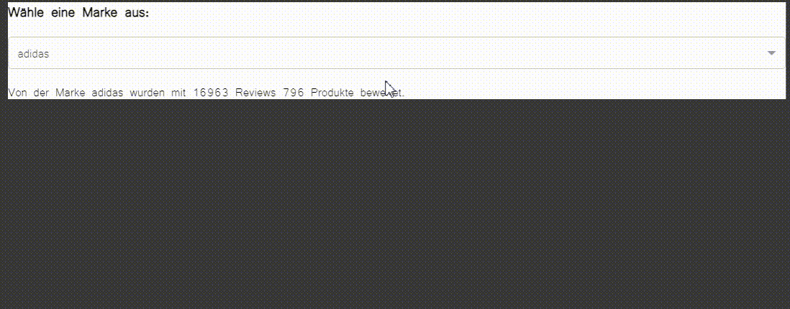

# Datenalalyse der Amazon Datensätze "Sport and Outdoors"

Im Rahmen dieses Notebooks wurde eine Analyse der aufbereiteten [Review und Meta Daten der Amazon Datensätze](https://nijianmo.github.io/amazon/index.html) von Jianmo Ni durchgeführt. Im Rahmen der Masterarbeit wurden die Datensätze zu "Sport and Outdoors" untersucht. Aus Kapazitätsgründen wurde für die Analyse der Review Daten der verkleinerte Datensatz mit 2.839.940 reviews herangezogen, da ohne Beschleunigung die Verarbeitung von mehr als 12 Mio. Zeilen zu lange Laufzeiten aufweist.

<Br>
<p align="center">
  
</p>
<Br>


## Aufbau der Analyse

Neben dem ersten strukturellen und inhaltlichen Analyse der beiden Datensätze werden bewusst Spalten selektiert, welche evtl. für die verwendung der Topic Modelling Modelle von Bedeutung sind und eingehender untersucht.

<ul>1. Analyse der Review Daten</ul>
    <ul>
     <ul>1.1. Allgemeiner Überblick</ul>
     <ul>1.2. Analyse einzelner Spalten</ul>
        <ul>
         <ul>1.2.1. reviewText</ul>
         <ul>1.2.2. unixReviewTime</ul>
         <ul>1.2.3. overall</ul>
         <ul>1.2.4. asin</ul>
        </ul>
    </ul>
<ul>2. Analyse der Meta Daten</ul>
    <ul>
     <ul>2.1. Allgemeiner Überblick</ul>
     <ul>2.2. Analyse einzelner Spalten</ul>
        <ul>
         <ul>2.2.1. title</ul>
         <ul>2.2.2. brand</ul>
        </ul>
     </ul>
</ul>

<Br>

## Hinweis zum Notebook
### Glitly

Dieses Jupyter Notebook enthält Plotly Graphiken. Da diese in Github normalerweise aufgrund der statistischen Viewer nicht angezeigt werden können, wurde der Code mithilfe der Library [Gitly](https://github.com/Tiagoeem/gitly) in einem statistischen Format gerendert. Hierfür muss eine bestimmte Version von Plotly sowie glitly installiert werden:

```
%pip install gitly==1.0.1
%pip install plotly>4.0.0
```
Für eine statistische Darstellung muss nach dem Import der Library das Objekt für GitHub instanziiert werden. Dies erfolgt durch die eingabe von "github" als Parameter.

```
# Import des Glitly Plotters
from gitly.colab.plot import GitlyPlotter

# Instanziierung des Objekts
gitly = GitlyPlotter('github')
```

Nun können alle Plotlygraphiken auch in GitHub angezeigt werden, indem die Ausgabe der Diagramme angepasst wird:

```
fig = px.bar(df, x="column_1", y="column_2")
gitly.show(fig)
```

Um wieder auf eine dynamische Darstellung zu wechseln, muss das Objekt mithilfe des Parameters "colab" neu instanziiert werden. Wichtig hierbei zu beachten ist, dass diese Library speziell für Colab entwickelt wurde und auch nur in diesem Framework verwendet werden kann. Wird das Notebook in einem anderen Editor ausgeführt, kann glitly gelöscht werden und die Ausgabe der Graphiken erfolgt wie gewohnt über die übelichen Befehle von Plotly.

```
# Instanziierung des Objekts
gitly = GitlyPlotter('colab')
```

<Br>

### Jupyter-Dash

Eine weitere Library, welche zur Visualisierung der Outputs herangezogen wurde, ist Dash.
Die letzte Analyse des Notebooks befasst sich mit der Anzahl der Reviews in Bezug auf die Marke und Produkte. Mithilfe des DropDown Menus lassen sich die Top 20 am häufigsten Bewerteten Marken auswählen und die Anzahl der Produkte ermitteln auf welche sich die Anzahl der Reviews bezieht.

<Br>



<Br>


Diese Darstellungsform ist ebenfalls im Rahmen von Github nicht möglich. Um auf das interaktive Inline Dashboard zuzugreifen, kann das Notebook herauntergeladen und entweder in Google Colab Pro oder einem lokalen Editor, wie beispielsweise VS Code ausgeführt werden. 

