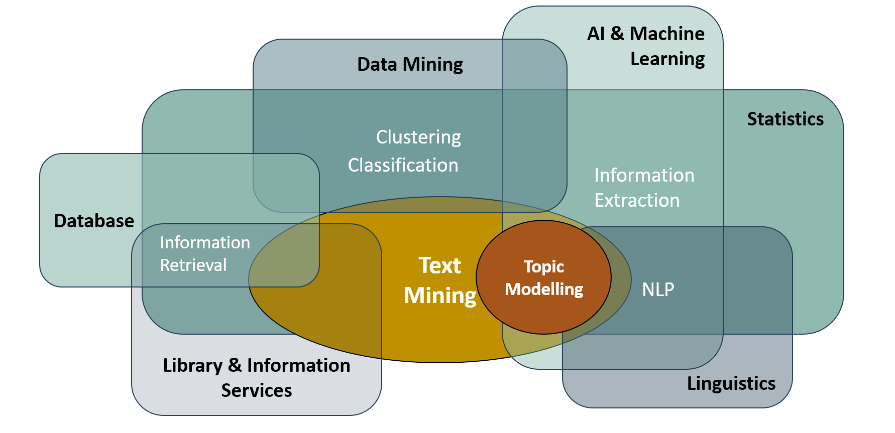

# Empirische Evaluation von "State Of The Art" Topic Modeling Ansätze am Beispiel von Produktreviews für die Entscheidungsunterstützung in Unternehmen

<center></center>
von [Sandra Nuißl](Eigenständigkeitserklärung.pdf) - 14.08.2023
<Br>
<Br>

## Inhalt
Die Masterarbeit baut beinhaltet eine Reihe von Notebooks, welch in der schriftlichen Ausarbeitung beschrieben wurden. Die programatischen Inhalte können unter folgenden Links eingesehen werden:
1. [Datenanalyse der Amazon Daten](Datenanalyse)
2. [Datapreparation](Datapreperation)
3. [Beschleunigung der Dataprepartarion mit PySpark](Beschleunigung%20mit%20PySpark)
4. [Implementierung und Evaluierung der Topic Modelling Modelle](Topic%20Modelling)
5. [Konzept einer optimierten Analyse von Produktreviews](Konzept)
<Br>

## Themenstellung
Im Rahmen dieser Masterarbeit sollen Methoden zum Thema Topic Modelling aus dem Bereich des Maschine und Deep Learning untersucht sowie verglichen werden. LDA ist eines der weitverbreiteten Modelle für Topic Modellig, aber gibt es noch smartere Lösungen? Welche Methoden gibt es noch und welche Vor- bzw. Nachteile weisen diese auf? Welches Modell liefert die besten Ergebnisse und welche Informationen lassen sich mithilfe des Topic Modelling aus Produktbewertungen extrahieren? Ziel der Arbeit ist es eine State of the Art Analyse von verschiedenen Topic Modellig Modellen aus Machine und Deep Learning durchzuführen und die Algorithmen mithilfe verschiedener Metriken zu evaluieren. Anschließend soll ein Vorschlag für ein optimiertes Analyse Dashboard für Produktreviews erstellt werden, um verschiedene Kernfragen in einem Bericht zu vereinen und eine valide Grundlage für Entscheidungsträger zu schaffen. Die Analyse der Reviewtexte soll über eine allgemeine Clusterbildung hinaus gehen und beispielsweise einen zeitlichen Verlauf der Bewertungen enthalten, um so die Entwicklung eines Produktes bewerten zu können oder Trend zu erkennen (Highlighten). Weitere Beispiele sind die Betrachtung von Mulithemen oder das Erkennen von Hierarchien. Somit ergibt sich für diese Masterarbeit folgende Forschungsfrage:

<Hr>
<p align="center">„Empirische Evaluation von ‚State of the Art‘ Topic Modelling Ansätze am Beispiel von Produktreviews für die Entscheidungsunterstützung in Unternehmen.“</p>
<Hr>
<Br>

## Methodik
Im Rahmen dieser Masterarbeit werden mithilfe von Python verschiedene State of the Art Topic Modelling Modelle implementiert und evaluiert. Die verwendeten Algorithmen sind LSA, LDA, Top2Vec, BERTopic und ZeroShotTM. Zu Beginn der Implementierung wird der Amazon Datensatz „Sport_and_Outdoors_5“, welcher Produktbewertungen sowie einige Zusatzinformationen enthält, analysiert und die Reviewtexte in einer Perprocessing Pipeline bereinigt. Dies hat den Zweck, dass alle Modelle die gleichen Inputwerte erhalten. Auf diese Weise soll eine Vergleichbarkeit der Evaluierungsergebnisse geschaffen werden. Für die Evaluierung der Modelle werden die Metriken der Kohärent, Perplexity und Similarity herangezogen. Darüber hinaus werden die Ergebnisse der Topic Modelling Modelle qualitativ sowie quantitativ diskutiert. Auf Basis dieser Untersuchungen wird das beste Modell ausgewählt und ein Konzept zur optimierten Analyse von Produktbewertungen erstellt, um wichtige Informationen für Entscheidungsträger zu extrahieren und eine Entscheidungsgrundlage zu liefern.

<Br>

## Hinweis zu den Notebooks
### Glitly

Dieses Jupyter Notebook enthält Plotly Graphiken. Da diese in Github normalerweise aufgrund der statistischen Viewer nicht angezeigt werden können, wurde der Code mithilfe der Library [Gitly](https://github.com/Tiagoeem/gitly) in einem statistischen Format gerendert. Hierfür muss eine bestimmte Version von Plotly sowie glitly installiert werden:

```
%pip install gitly==1.0.1
%pip install plotly>4.0.0
```
Für eine statistische Darstellung muss nach dem Import der Library das Objekt für GitHub instanziiert werden. Dies erfolgt durch die eingabe von "github" als Parameter.

```
# Import des Glitly Plotters
from gitly.colab.plot import GitlyPlotter

# Instanziierung des Objekts
gitly = GitlyPlotter('github')
```

Nun können alle Plotlygraphiken auch in GitHub angezeigt werden, indem die Ausgabe der Diagramme angepasst wird:

```
fig = px.bar(df, x="column_1", y="column_2")
gitly.show(fig)
```

Um wieder auf eine dynamische Darstellung zu wechseln, muss das Objekt mithilfe des Parameters "colab" neu instanziiert werden. Wichtig hierbei zu beachten ist, dass diese Library speziell für Colab entwickelt wurde und auch nur in diesem Framework verwendet werden kann. Wird das Notebook in einem anderen Editor ausgeführt, kann glitly gelöscht werden und die Ausgabe der Graphiken erfolgt wie gewohnt über die übelichen Befehle von Plotly.

```
# Instanziierung des Objekts
gitly = GitlyPlotter('colab')
```
