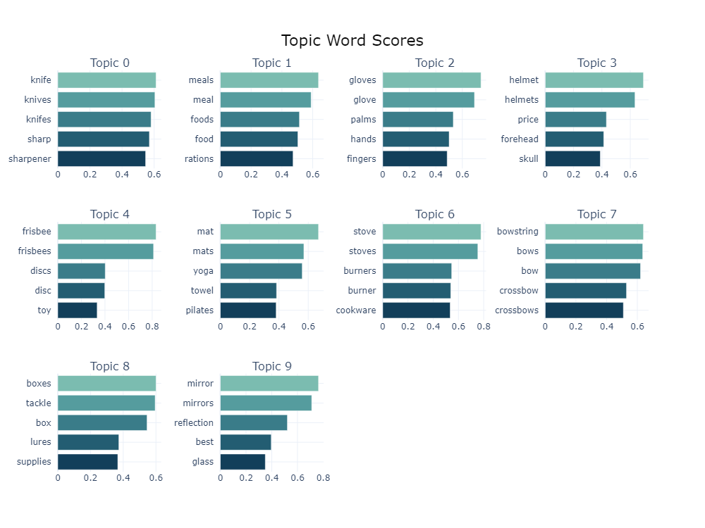
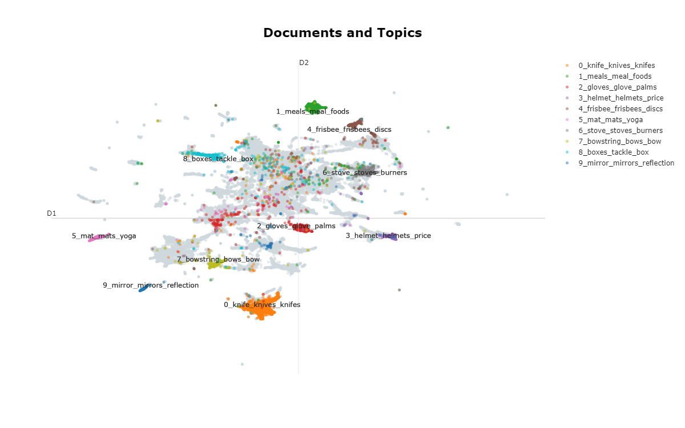

# Implementierung des Topic Modelling Modells: BERTopic
„BERTopics“ ist die Kurzform für „Bidirectional Encoder Representations from Transformers“ und ist eine der modernsten Techniken im Bereich des Topic Modelling (Nick, 2023). Es zählt zu den Deep Learning Modellen und wurde 2019 von Jacob Devlin, Ming-Wei Chang, Kenton Lee und Kristina Toutanova in einem Paper „BERT: Pre-training of Deep Bidirectional Transformers for Language Understanding“ vorgestellt (Devlin, Chang, Lee, & Toutanova, 2019). Das Modell lässt sich in mehrere Schritte untergliedern, welche durch das Pre-Trained-Modell in den Standardeinstellungen vordefiniert sind. Jedoch sind die einzelnen Prozessschritte des Modells nicht voneinander abhängig, wodurch diese sich unterschiedlich kombinieren lassen. Je nach Wunsch und Anwendungsfall können unterschiedliche Modelle zum Clustering, der Tokenisierung oder dem Fine Tuning angewendet werden. Auf diese Weiße ist bei BERTopic eine gewisse Modularität möglich (Grootendorst, BERTopic, 2023):

<Br>
<p align="center">
  
</p>
<p align="center">Stufen des Topic Modelling Modells BERTopic (Eigene Darstellung in Anlehnung an (Grootendorst, 2023))</p>

<Br>

## Besonderheiten der Implementierung
Im Rahmen dieser Masterarbeit wurde die Implementierung eines BERTopic Modelles mithilfe der [Library von BERTopic](https://maartengr.github.io/BERTopic/algorithm/algorithm.html#code-overview) selbst durchgeführt. Bevor die Implementierung von BERTopic beginnen kann, ist es hilfereich zur Beschleunigung der Prozesse des Embeddings und der Dimensionsreduktion PyTorch zu installieren. Auf diese Weise lässt sich mithilfe der NVIDIA-GPUs die Laufzeit um das bis zu 4,5 Fache beschleunigen (Grootendorst, Faster Topic Modeling with BERTopic and RAPIDS cuML, 2023).

Die Implementierung ist hierfür im Folgenden aufgeführt:

```
# Insatlationen
%pip install torch torchvision torchaudio --extra-index-url https://download.pytorch.org/whl/cu116
%pip install bertopic
```
```
# Imports
from bertopic import BERTopic
```

### __Intitialisierung__
Das Pre-Trained-Modell von BERtopic wird initialisiert, indem die Klasse „BERTopic“ aufgerufen und in einer Variable gespeichert wird. Hierbei sind die Stufen des Embeddings, der Dimensionsreduktion und des Clusterings zusammengefasst. 
```
bert_model = BERTopic(embedding_model          = SentenceTransformer("all-MiniLM-L6-v2")
                      umap_model               = UMAP(n_neighbors=15, n_components=3, min_dist=0.0, metric='cosine', verbose=True)
                      hdbscan_model            = HDBSCAN(min_cluster_size=15, metric='euclidean', cluster_selection_method='eom',
                                                         prediction_data=True, core_dist_n_jobs=-1)
                      vectorizer_model         = CountVectorizer(stop_words="english")
                      ctfidf_model             = ClassTfidfTransformer()
                      representation_model     = KeyBERTInspired()
                      calculate_probabilities  = True,
                      verbose                  = True)
```
<Br>

### __Anwendung des Modells__
Die Anwendung auf den Amazondatensatz erfolgt über ein "fit_transform()" Funktion, welche die Topics pro Review, sowie deren Wahrscheinlichkeiten ausgibt.
```
topics, probabilities = bert_model.fit_transform(cleaned_list)
```
<Br>

## Ergebnisse

BERTopic baut auf einem Clustering-Embeddings-Ansatz auf und erweitert diesen um eine klassenbasierte TF-IDF-Variante zur Darstellung der Themen (Grootendorst, 2022, S. 2). Die Dimensionsreduktion erfolgt mithilfe von UMAP und für das Clustering wurde HDBSCAN herangezogen, wodurch die semantische Komponente bei der Erstellung von Clustern berücksichtigt wird. Darüber hinaus sind alle Daten bei HDBSCAN normalisiert, um Größenunterschiede auszugleichen. Das Ergebnis ist eine Ansammlung von Clustern, welche in der Abbildung zu sehen sind. Der weiße "Nebel" stellt die Ausreißer da, welche keinem Cluster/ Topic zugeordnet werden konnten (Grootendorst, BERTopic, 2023).
<Br>


<p align="center">Darstellung der Dimensionsreduktion und des Clustering durch BERTopic (Eigene Darstellung)</p>
<Br>

### Repräsentative Wörter der Topics
Für die ermittelten Cluster werden Themen identifiziert. Das Topic Modelling Modell gibt für jedes Topic eine Reihe repräsentativer Wörter aus, welche zur Interpreation der Themen dienen. BERTopic verfügt hierfür über unterschiedlichste Visualisierungsmöglichkeiten:
<Br>
<p align="center">
  
</p>
<p align="center">Repräsentative Wörter je Topic (Eigene Darstellung)</p>
<Br>

Eine Weitere Möglichkeit von BERTopic ist die Visualisierung des Verhältnisses der Dokumente in Bezug auf die Topics. Hierbei werden die Dokumente in eine zweidimensionale Darstellung geplottet. Die Farbe Repräsentiert das Topic des Dokuments. Auf diese Weise lässt sich erkennen, ob die Dokumente den richtigen Themen zugeordnet wurden oder ob es überlappende Themen gibt.
<p align="center">
  
</p>
<p align="center">Verhältnis der Dokumente in Bezug auf die Topics (Eigene Darstellung)</p>
<Br>


## Literatur

Devlin, J., Chang, M.-W., Lee, K., & Toutanova, K. (07. 06 2019). BERT: Pre-training of Deep Bidirectional Transformers for. Von Association for Computational Linguistics: https://aclanthology.org/N19-1423.pdf abgerufen

Grootendorst, M. (14. 04 2023). BERTopic. Abgerufen am 28. 04 2023 von github.com: https://maartengr.github.io/BERTopic/algorithm/algorithm.html#1-embed-documents

Grootendorst, M. (11. 03 2022). BERTopic: Neural topic modeling with a class-based TF-IDF procedure. Abgerufen am 28. 04 2023 von Cornell University: https://arxiv.org/abs/2203.05794

Grootendorst, M. (19. 01 2023). Faster Topic Modeling with BERTopic and RAPIDS cuML. Abgerufen am 02. 08 2023 von medium.com: https://medium.com/rapids-ai/faster-topic-modeling-with-bertopic-and-rapids-cuml-5c7559aba898

Nick, T. P. (11. 02 2023). Topic Modeling with BERTopic: A Cookbook with an End-to-end Example (Part 1). Abgerufen am 28. 04 2023 von medium.com: https://medium.com/@nick-tan/topic-modeling-with-bertopic-a-cookbook-with-an-end-to-end-example-part-1-3ef739b8d9f8
