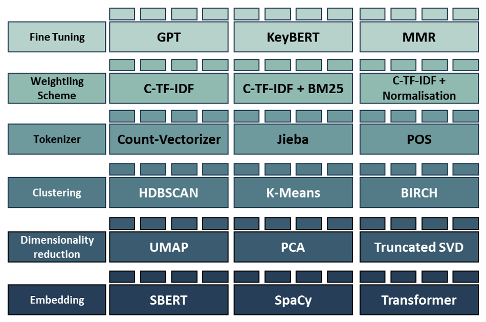

# Implementierung des Topic Modelling Modells: BERTopic


<Br>
<p align="center">
  
</p>
<p align="center">Stufen des Topic Modelling Modells BERTopic (Eigene Darstellung in Anlehnung an (Grootendorst, 2023))</p>

<Br>

## Besonderheiten der Implementierung
Im Rahmen dieser Masterarbeit wurde die Implementierung eines BERTopic Modelles mithilfe der [Library von BERTopic](https://maartengr.github.io/BERTopic/algorithm/algorithm.html#code-overview) selbst durchgeführt. Bevor die Implementierung von BERTopic beginnen kann, ist es hilfereich zur Beschleunigung der Prozesse des Embeddings und der Dimensionsreduktion PyTorch zu installieren. Auf diese Weise lässt sich mithilfe der NVIDIA-GPUs die Laufzeit um das bis zu 4,5 Fache beschleunigen (Grootendorst, Faster Topic Modeling with BERTopic and RAPIDS cuML, 2023).

Die Implementierung ist hierfür im Folgenden aufgeführt:

```
# Insatlationen
%pip install torch torchvision torchaudio --extra-index-url https://download.pytorch.org/whl/cu116
%pip install bertopic
```
```
# Imports
from bertopic import BERTopic
```

### __Intitialisierung und Training__


```
model_
```
<Br>

## Ergebnisse
Top2Vec wählt aus den Gründen der Skalierbarkeit für große Datensätze und dem Erhalt der globalen sowie lokalen Strukturen UMAP. Um die Topics aus den Reviews in einem semantischen Raum zu extrahieren, wird HDBSACN als Clustering Algorithmus herangezogen. Dieses bildet dichte- und hierarchiebasierte Cluster und markiert alle Reviews, welche kein erkennbares zugrunde liegendes Thema aufweisen als Rauschen. Somit wird jedem Einbettungsvektor entweder ein Clusterlabel oder ein Rauschlabel zugeordnet (Angelov, 2020, S. 6-8). Die Ergebnisse dieser Clusteringanalyse für den Amazondatensatz wurde in einem 3D Scatterplot visuell veranschaulicht:
<Br>


<p align="center">Darstellung der Dimensionsreduktion und des Clustering von Top2Vec nach dem Embedding mit Doc2Vec (Eigene Darstellung)</p>
<Br>

### Repräsentative Wörter der Topics
Das Topic Modelling Modell gibt für jedes Topic eine Reihe repräsentativer Wörter aus, welche zur Interpreation der Themen dienen.

-	Topic 0: lasagna deliciozs tasty bland flavour
-	Topic 1: recommend price good quality overall
-	Topic 2: lansky stone sharpening stone strop
-	Topic 3: hatchet fiskars hatchets logs chopping
-	Topic 4: mirrors mirror mirrycle view traffic
-	Topic 5: mat xoga manduka mats jade poses studio
-	Topic 6: helmet helmets giro visor crash ventilator
-	Topic 7: elbow flexbar tennis tendonitis thera
-	Topic 8: coolers cooler igloo ice drinks yeti
-	Topic 9: frisbee frisbees disc aerobie discs

<Br>

Top2Vec bietet darüber hinaus zur Visualisierung eine einfache Implementierung einer Wordcloud an.
<p align="center">
  
</p>
<p align="center">Wordcloud zur Visualisierung der Topics (Eigene Darstellung)</p>
<Br>

## Literatur

Angelov, D. (19. 08 2020). TOP2VEC: DISTRIBUTED REPRESENTATIONS OF TOPICS. Abgerufen am 10. 07 2023 von https://arxiv.org/pdf/2008.09470.pdf

Lande, J. (29. 06 2022). Understanding Topic Modeling with Top2Vec. Abgerufen am 10. 07 2023 von medium.com: https://medium.com/@janhavil1202/understanding-topic-modeling-with-top2vec-cdf58bcd6c09

Le, Q., & Mikolov, T. (22. 05 2014). Distributed Representations of Sentences and Documents. Abgerufen am 11. 07 2023 von arxiv.org: https://arxiv.org/pdf/1405.4053.pdf

Weng, J. (21. 12 2020). Topic Modeling in One Line with Top2Vec. Abgerufen am 10. 07 2023 von towardsdatascience.com: https://towardsdatascience.com/topic-modeling-in-one-line-with-top2vec-a413991aa0ef

