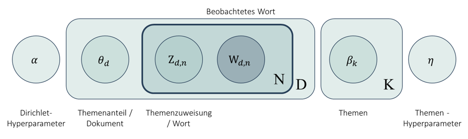
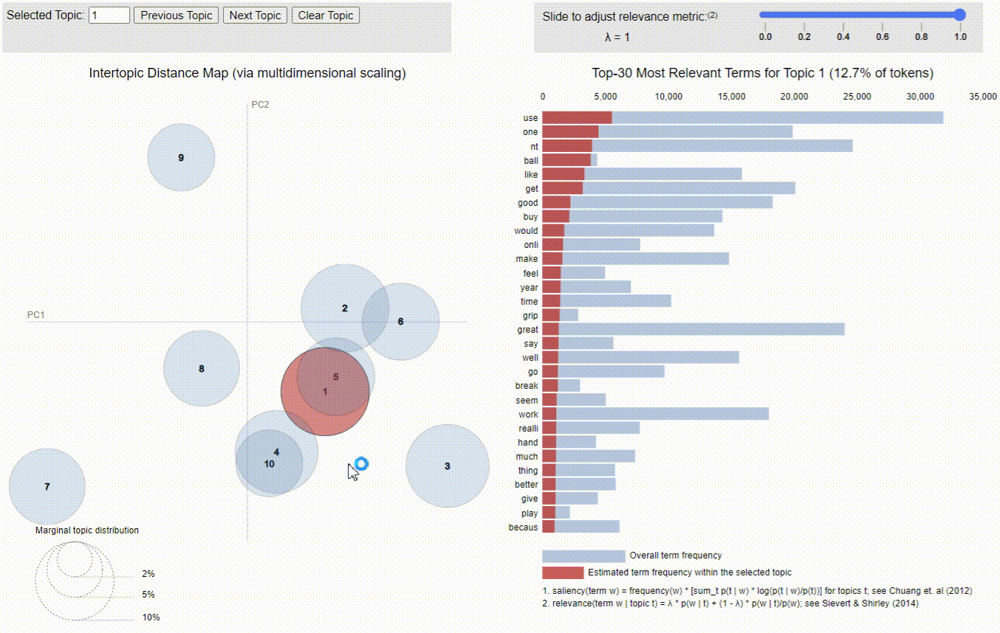
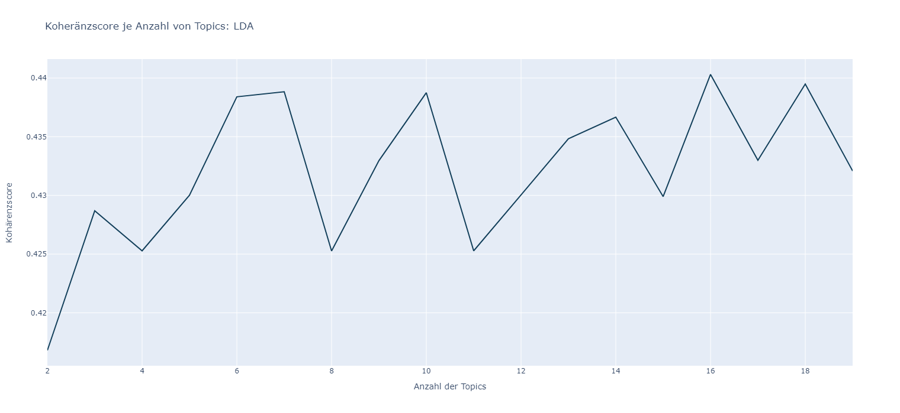

# Implementierung des Topic Modelling Modells: LDA

LDA ist ein Akronym für „Latent-Dirichlet-Allokation“ und zählt zu den statistisch generativen Wahrscheinlichkeitsmodellen. Ziel ist es, latente Themen zu identifizieren und diesen Worten unterzuordnen (Burkhardt & Kramer, kein Datum, S. 2). „Latent“ bezieht sich hier auf etwas Existentes, jedoch noch nicht Entwickeltes. Dies lässt sich auch als „verborgen“ beschreiben, da es sich bei den zu extrahierenden Themen um unbekannte „Hidden Topics“ handelt (Seth, 2021). LDA wurde bereits im Jahr 2000 in einer Veröffentlichung über Genanalysen angewandt und 2003 implementierten David Blei, Andrew Ng und Michael Jordan das Modell für die Analyse von Textdokumenten. 
Vereinfacht dargestellt sind die Dokumente Wahrscheinlichkeitsverteilungen von Topics, welche wiederum Wahrscheinlichkeitsverteilungen von Wörtern darstellen. Auf diese Weise erstellt das Modell Datenpunkte und schätzt deren Wahrscheinlichkeit. Aus diesem Grund wird LDA auch in die Gruppe der generativen probabilistischen Algorithmen eingeordnet (Seth, 2021). 
<Br>
<p align="center">
  
</p>
<p align="center">Grafische Veranschaulichung LDA (Eigene Abbildung in Anlehnung an (Blei, Ng, & Jordan, Latent Dirichlet Allocation, 2003))</p>

<Br>

## Besonderheiten der Implementierung
Im Rahmen dieser Masterarbeit wurde die Implementierung eines LDA Modelles mithilfe von [Gensim](https://radimrehurek.com/gensim/models/ldamodel.html) durchgeführt. Die beiden wichtigsten Schritte der Implementierung sind hierfür im Folgenden aufgeführt:

```
# Insatlationen
%pip install pyLDAvis
```
```
# Imports
import pyLDAvis
import pyLDAvis.gensim
pyLDAvis.enable_notebook()
from pprint import pprint
```

### 1. __Vektorisierung__
   
Nach der Erzeugung der Token aus zu untersuchenden Texten, wird mithilfe des Bag-of-Word Ansatzes "Doc2Bow" eine Vektorisierung durchgeführt. Hierbei werden die beiden wichtigsten Komponente für das LDA-Modell von gensim erstellt. Das sogenannte „Dictionary“ beinhaltet eine Liste aller Wörter, welche in den Dokumenten – hier die einzelnen Produktbewertungen – vorkommen. Der Korpus enthält hingegen die Dokument-Term-Matrix (CR, 2020).

```
# Erstellung einers Dictionary
dictionary = corpora.Dictionary(token_list)

# Vectorisierung: Begriffs - Dokumenten - Häufigkeit (Korpus)
corpus = [dictionary.doc2bow(word) for word in tqdm(token_list, desc ="Status Vektorisierung: ", total = len(token_list))]
```
<Br>

### 2. __Dimensionsreduktion und Clustering__
Um die Verarbeitung der Daten zu beschleunigen wird die Klasse [„LdaMulticore“](https://radimrehurek.com/gensim/models/ldamulticore.html) verwendet. Dieses Modell nutzt alle zur Verfügung stehenden CPU-Kerne und parallelisiert das Modelltraining durch Multiprocessing (Gensim-Dokumentation, 2023). Für die Implementierung werden die initialisierten Parameter eingesetzt und gewünschte Anzahl der Topics auf 10 gesetzt (Kapadia, 2019).

```
lda_model = gensim.models.LdaMulticore(corpus = corpus,
                                       id2word = dictionary,
                                       num_topics = 10) 
```
<Br>

## Ergebnisse
Gensim beitet ein interaktives Visualisierungstool, welches die Ergebnisse der Topic Modelling Abalyse von LDA optisch darstellt. Auf der linken Seite sind die Abstände zwischen den einzelnen Topics zu erkennen. Wird ein Thema ausgewählt gibt das Balkendiagramm auf der rechten Seite Aufschluss über die Häufigkeitsverteilung der Wörter in dem entsprechenden Topic (Mageshwaran, 2019).
<Br>
```
visualization_lda = pyLDAvis.gensim.prepare(lda_model, corpus, dictionary)
```


<p align="center">Wahrscheinlichkeitsverteilung der Topics pro Review (Eigene Darstellung)</p>
<Br>

### Repräsentative Wörter der Topics
Durch dieser Wahrscheinlichkeiten lassen sich Dominate Reviews eines Topics identivizieren, welche zur Interpreation der Themen dienen.

-	Topic 0: nt get one like great mat go buy use time
-	Topic 1: use one get size small nt year good time box
-	Topic 2: great good work price use well veri product qualiti
-	Topic 3: knife nt blade veri use make like sharp one good
-	Topic 4: use veri well good product make like nt work get
-	Topic 5: veri good great use fit well product nice would comfort
-	Topic 6: use bike get nt work one need chain well make
-	Topic 7: work bike nt would get use one fit little like
-	Topic 8: great use easi camp work love make stove water bag
-	Topic 9: use one nt ball like get good buy would onli
<Br>

Die Aussagekraft der repträsentativen Wörter würde sich durch ein Hyperparametertuning verbessern lassen, indem die Wahl der opitmalen Topics angepasst wird:
<p align="center">
  
</p>
<p align="center">Wahl der optimalen Anzahl von Topics für eine optimierte Kohärenz (Eigene Darstellung)</p>
<Br>

## Literatur

Blei, D. M., Ng, A. Y., & Jordan, M. I. (01. 03 2003). Latent Dirichlet Allocation. Abgerufen am 03. 08 2023 von Journal of Machine Learning Research 3: https://dl.acm.org/doi/pdf/10.5555/944919.944937

Burkhardt, S., & Kramer, S. (kein Datum). A Survey of Multi-Label Topic Models. (I. o. Johannes Gutenberg University of Mainz, Herausgeber) Abgerufen am 21. 06 2023 von https://www.kdd.org/exploration_files/7._CR._23._A_Survey_of_Multi-Label_Topic_Models_-_Final.pdf

CR, A. (26. 07 2020). Topic Modeling using Gensim-LDA in Python. Abgerufen am 20. 06 2023 von medium.com: https://medium.com/analytics-vidhya/topic-modeling-using-gensim-lda-in-python-48eaa2344920

Gensim-Dokumentation. (2023). radimrehurek.com. Abgerufen am 21. 06 2023 von models.ldamulticore – parallelized Latent Dirichlet Allocation: https://radimrehurek.com/gensim/models/ldamulticore.html

Kapadia, S. (19. 08 2019). Evaluate Topic Models: Latent Dirichlet Allocation (LDA). Abgerufen am 21. 06 2023 von towardsdatascience.com: https://towardsdatascience.com/evaluate-topic-model-in-python-latent-dirichlet-allocation-lda-7d57484bb5d0

Mageshwaran, R. (26. 12 2019). Topic Modeling: Art of Storytelling in NLP. Abgerufen am 03. 08 2023 von medium.com: https://medium.com/technovators/topic-modeling-art-of-storytelling-in-nlp-4dc83e96a987

Seth, N. (23. 08 2021). Part 2: Topic Modeling and Latent Dirichlet Allocation (LDA) using Gensim and Sklearn. Abgerufen am 19. 01 2023 von https://www.analyticsvidhya.com/blog/2021/06/part-2-topic-modeling-and-latent-dirichlet-allocation-lda-using-gensim-and-sklearn/
