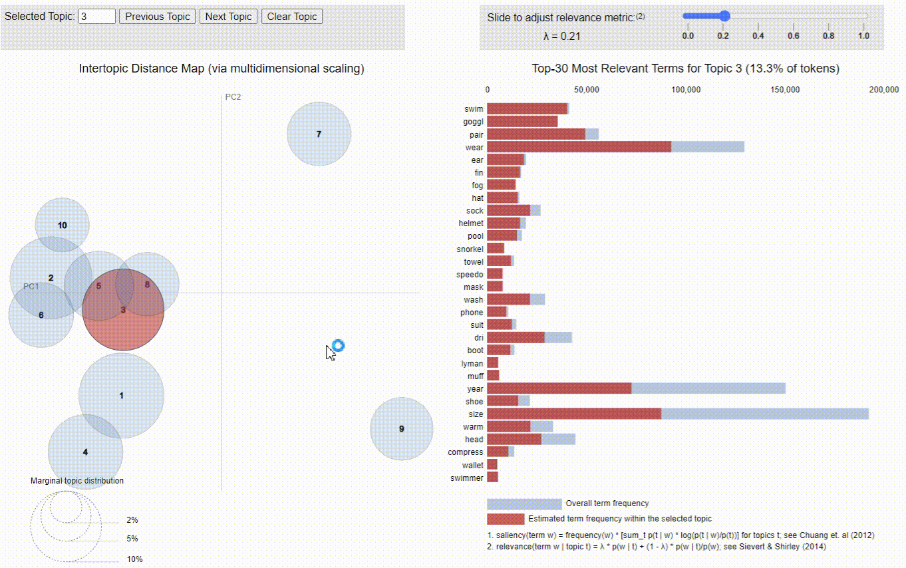

# Implementierung des Topic Modelling Modells: LDA


<Br>
<p align="center">
  
</p>
<p align="center">SVD – Methode (eigene Darstellung in Anlehung an (Deerwester, Dummais, & Harshman, 1990))</p>

<Br>

## Theoretischer Hintergrund


<Br>

## Besonderheiten der Implementierung
### Glitly

 [Gitly](https://github.com/Tiagoeem/gitly) 

```
%pip install gitly==1.0.1
%pip install plotly>4.0.0
```


<Br>

## Ergebnisse

<Br>


<p align="center">GIF</p>

<Br>
