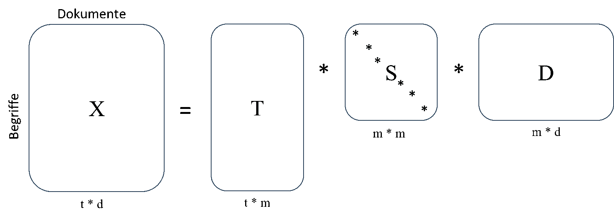

# Implementierung des Topic Modelling Modells: LSA

LSA ist die Kurzform für die „Latent Semantic Analysis“ und beschreibt eine Methode zur Dimensionsreduktion von Texten und Dokumenten. Es zählt zu den Algorithmen des unsupervised leanings, wodurch es keine vorausgesetzte Grundwahrheit gibt. LSA setzt sich zusammen aus einer Verteilungshypothese, welche die Häufigkeit des gemeinsamen Auftretens von Wörtern festsetzt, und der Matrixfaktorisierungstechnik „Singular Value Decomposition“, kurz SVD (Ioana, 2020). 

<Br>
<p align="center">
  
</p>
<p align="center">Bild</p>

<Br>


## Theoretischer Hintergrund


<Br>

## Besonderheiten der Implementierung
### Glitly

 [Gitly](https://github.com/Tiagoeem/gitly) 

```
%pip install gitly==1.0.1
%pip install plotly>4.0.0
```


<Br>

## Ergebnisse

<Br>


<p align="center">GIF</p>

<Br>

