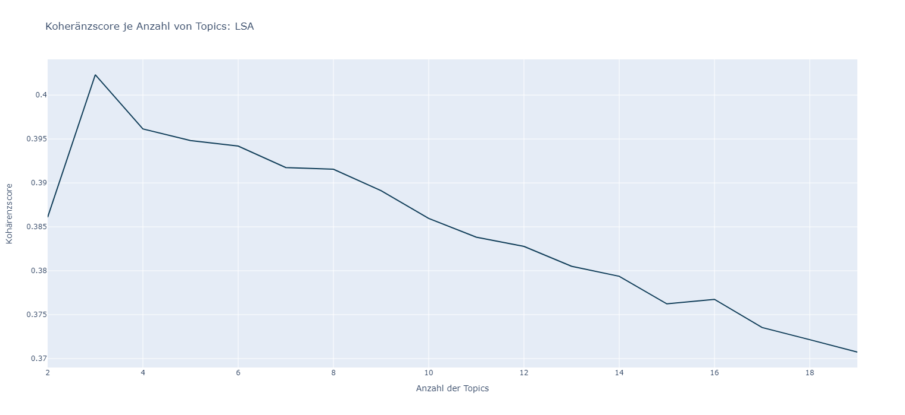

# Implementierung des Topic Modelling Modells: LSA

LSA ist die Kurzform für die „Latent Semantic Analysis“ und beschreibt eine Methode zur Dimensionsreduktion von Texten und Dokumenten. Es zählt zu den Algorithmen des unsupervised leanings, wodurch es keine vorausgesetzte Grundwahrheit gibt. LSA setzt sich zusammen aus einer Verteilungshypothese, welche die Häufigkeit des gemeinsamen Auftretens von Wörtern festsetzt, und der Matrixfaktorisierungstechnik „Singular Value Decomposition“, kurz SVD (Ioana, 2020). 

<Br>
<p align="center">
  
</p>
<p align="center">SVD – Methode (eigene Darstellung in Anlehung an (Deerwester, Dummais, & Harshman, 1990))</p>

<Br>

## Besonderheiten der Implementierung
Im Rahmen dieser Masterarbeit wurde die Implementierung eines LSA Modelles mithilfe von [Scikit-Learn](https://scikit-learn.org/stable/modules/generated/sklearn.decomposition.TruncatedSVD.html) durchgeführt. Die beiden wichtigsten Schritte der Implementierung sind hierfür im Folgenden aufgeführt:

```
from sklearn.feature_extraction.text import TfidfVectorizer
from sklearn.decomposition import TruncatedSVD 
```

### 1. __Vektorisierung__
   
Mithilfe des  [TF - IDF Vectorizers](https://scikit-learn.org/stable/modules/generated/sklearn.feature_extraction.text.TfidfVectorizer.html) werden die langkettigen strings des bereinigten Datensatzes in Token zerlegt, welche von dem Machine Learning Model verarbeitet werden können (Ioana, 2020). Das Ergebnis ist eine Wort - Dokumeten - Matrix, welche in den Spalten die Worte und in den Zeilen die Dokumente abbildet. Die Zahlen in den Zellen repräsentieren die Wahrscheinlichkeiten der Wörter pro Dokument.

```
# Initialisierung des Vectorizers
vectorizer = TfidfVectorizer(tokenizer=tokenizer.tokenize, min_df=0.05)

# Erstellung der Wort-Dokumenten Matrix
text_vec = vectorizer.fit_transform(reviews_df["cleanedText"]).toarray()
```
<Br>

### 2. __Dimensionsreduktion und Clustering__

Nach der Vektorisierung wird die Dimensionsreduktion und das Clustering mithilfe der Singulärwertzerlegung (SVD) durchgeführt. Es kann zwischen der vollständigen SVD, welche die gesamte Varianz eines Datensatzes abbildet, und der abgeschnittenen SVD gewählt werden. Bei Letzterer lässt sich die Anzahl der endgültigen Komponenten festgelegt, um mit reduzierten Merkmalen die Daten relativ gut zu abzubilden. Aus diesem Grund wird im Rahmen dieser Masterarbeit die Klasse [„TruncatedSVD“](https://scikit-learn.org/stable/modules/generated/sklearn.decomposition.TruncatedSVD.html)von sklearn initialisiert. Über den Parameter „n_iter“ können die Anzahl der Merkmale beschränkt werden und mithilfe von „n_components“ ist festzulegen, wie viele Themen das Modell bilden soll (Ioana, 2020).


```
# SVD 
lsa_model = TruncatedSVD(n_components=10, n_iter=100, random_state=42)
lsa_topic = lsa_model.fit_transform(text_vec)
```


<Br>

## Ergebnisse
Die Dokument-Topic-Matrix des Datensatzes „Sport and Outdoors“ umfasst 10 Topics in 100.000 Dokumenten. Die Dokumente werden über einen Vektor dargestellt, dessen Länge durch die Anzahl der Topics festgelegt ist (MEHROTRA, 2022). Jedes Topic tritt in den einzelnen Reviews mit einer unterschiedlich hohen Wahrscheinlichkeit auf. Dies lässt sich mithilfe des interaktiven Dashboards des Notebooks nachvollziehen.
<Br>


<p align="center">Wahrscheinlichkeitsverteilung der Topics pro Review (Eigene Darstellung)</p>
<Br>

### Repräsentative Wörter der Topics
Durch dieser Wahrscheinlichkeiten lassen sich Dominate Reviews eines Topics identivizieren, welche zur Interpreation der Themen dienen.

-	Topic 1: use great work veri good get one well buy like
-	Topic 2: great work price product love fit qualiti high perfect look
- Topic 3: good qualiti veri price fit product nice look size great
-	Topic 4: work well veri good make seem hold fit bike perfect 
-	Topic 5: use good product qualiti price great easi time year high
-	Topic 6: veri nice use well easi love make fit great hold
-	Topic 7: love work good perfect use buy year well fit easi
-	Topic 8: fit perfect use size nice well like small look need
-	Topic 9: get veri love good nice little great easi fit take
-	Topic 10: make well product like realli love would hold seem look
<Br>

Die Aussagekraft der repträsentativen Wörter würde sich durch ein Hyperparametertuning verbessern lassen, indem die Wahl der opitmalen Topics angepasst wird:


<p align="center">Wahl der optimalen Anzahl von Topics für eine optimierte Kohärenz (Eigene Darstellung)</p>
<Br>

## Literatur

Deerwester, S., Dummais, S. T., & Harshman, R. (10 1990). Indexing by Latent Semantic Analysis. Chicago: University of Chicago. Abgerufen am 24. 04 2024 von asistdl.onlinelibrary.wiley.com: https://www.semanticscholar.org/paper/Indexing-by-Latent-Semantic-Analysis-Deerwester-Dumais/20a80a7356859daa4170fb4da6b87b84adbb547f

IONOS SE. (05. 04 2022). ASCII – Erklärung und Beispiele. Abgerufen am 08. 03 2023 von ionos.de: https://www.ionos.de/digitalguide/server/knowhow/ascii-american-standard-code-for-information-interchange/

MEHROTRA, R. (2022). Topic Modelling using LDA and LSA in Sklearn. Abgerufen am 25. 07 2023 von www.kaggle.com: https://www.kaggle.com/code/rajmehra03/topic-modelling-using-lda-and-lsa-in-sklearn
