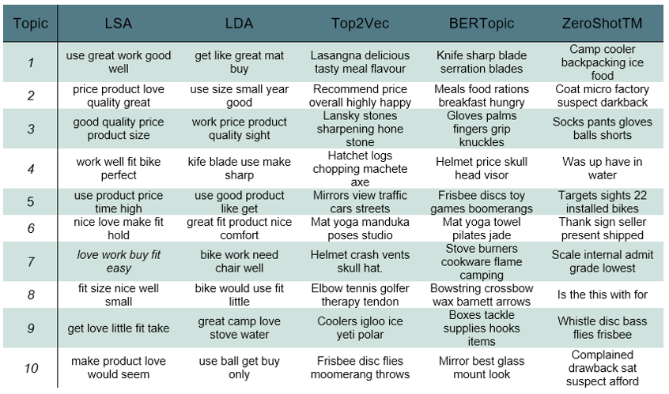

# Implementierung der Topic Modelling Modelle und deren empirische Evaluierung

In diesem Ordner des Github Repositorys sind die Notebooks der Implementierung und Evaluierung der fünf ausgewählten Topic Modelling Modelle. Da teilweise Probleme mit der Kompatibilität der verschiedenen Versionen von Libraries, welche für die einzelnen Modelle benötigt werden, aufgetreten sind, wurden diese in seperate Notebooks implementiert.

<p align="center">
  
</p>
<p align="center">Identifizierte Topics der Topic Modelling Modelle(Eigene Darstellung))</p>
<Br>

Für die Evaluierung wurden neben einem allgemeinen Vergleich der Vor- und Nachteile sowie einer qualitativen Untersuchung der Topics, drei Evaluierungsmetriken herangezogen:
1. Kohärenz
2. Perplexity
3. Similarity
<Br>   


## Kohärenz

### Theory
Die Kohärenz bezieht sich auf die semitische Verbundenheit von Wörtern, welche im Rahmen des Topic Modelling in Wortlisten gespeichert sind. Durch Sinnbeziehungen der Einheiten des Textes wirkt dieser auf den Leser semantisch konsistent und logisch (Rüdiger, Antons, Joshi, & Salge, 2022). Verallgemeinert gesagt ist eine Aussage kohärent, wenn sich die Inhalte gegenseitig stützen. Mithilfe von Themenkohärenzmaße lässt sich die Ähnlichkeit der Wörter in Bezug auf ein bestimmtes Thema messen (Kapadia, 2019). Die Berechnung der Kohärenz beginnt mit der Bildung von Wortpaaren im Rahmen der Segmentierung. Im Anschluss folgt die Wahrscheinlichkeitsberechnung zur Ermittlung der Auftrittswahrscheinlichkeit, welche die Basis der Kohärenzmessung liefert. Um die Beziehung der Wortpaare zu quanitfizieren kann das direkte oder indirekte Bewertungsmaß verwendet werden. Während der direkte Bestätigungswert die Wahrscheinlichkeiten der Wortpaarungen direkt ins Verhältnis zu den Wahrscheinlichkeiten der beide Teilelemente setzt, werden bei dem indirekten Bestätigungswert die Maßvektoren der beiden Teilmengen verglichen. Abschließend werden die daraus entstandenen Themenkohärenzen aggregiert zur Ermittlung der geammten Kohärenz (Röder, Both, & Hinneburg, 2015, S. 3 ff.).

<p align="center">
  
</p>
<p align="center">Berechnung des Kohärenzscores (Eigene Abbildung in Anlehnung an (Röder, Both, & Hinneburg, 2015, S. 5))</p>
<Br>

### Implementierung
Zur Berechnung der Kohärenz wird für die Modelle LSA, LDA, Top2Vec und BERTopic die Klasse zur Kohärenberechnung von [Gensim](https://radimrehurek.com/gensim/models/coherencemodel.html) herangezogen. Da LDA ebenfalls über Gensim implementiert wurden kann an das Modell statt der Parameter "topics" und "texts" direkt das Modell ("model") übergeben werden. Für die übrigen Modelle müssen die Parameter teilweise aus den Daten extrahiert und in das passen de Format transformiert werden, um den Score zu errechnen.
```
# Ermittlung der Kohärenz mithilfe von Gensim
coherence_model = CoherenceModel(topics     = topic_list, 
                                 texts      = token_list, 
                                 corpus     = corpus,
                                 dictionary = dictionary, 
                                 coherence  = 'c_v')
```
[ZeroShotTM](https://github.com/MilaNLProc/contextualized-topic-models/blob/master/contextualized_topic_models/evaluation/measures.py) bietet in der Dokumetation auf Github eine eigene Klasse, welche auf das Modell abgestimmt ist und ohne weiter Transformation der Daten implementiert werden kann.
```
# Ermittlung der Kohärenz mithilfe der Klasse von ZeroShotTM
coherence_model = CoherenceCV(texts=token_list, topics=topics)
```
<Br>

### Ergebnisse
Im Rahmen dieser Masterarbeit wurden die in der unten stehenden Abbildung gezeigten Kohärenzscores für die Modelle ermittelt. Je dunkter die Farbe, desto höher ist die Kohärenz. Die besten Werte haben BERTopic und Top2Vec erziehlt. Alle Werte lassen sich jedoch mit einem Hyperparamterttunig für die optimale Anzahl der Topics weiter erhöhen.
<p align="center">
  
</p>
<p align="center">Kohärenzen der Topic Modelling Modelle (Eigene Darstellung)</p>
<Br>


## Perplexity

### Theory
Perplexity bedeutet übersetzt so viel wie „Ratlosigkeit“ und bildet die durch die Anzahl der Wörter normalisierte inverse Wahrscheinlichkeit des Testsatzes ab (Campagnola, 2020). Es gibt Aufschluss darüber, wie gut ein Modell neue Daten verallgemeinern und vorhersagen kann, indem es den Abstand der Themenverteilung des Modells und der gleichmäßigen Wortverteilung des erstellten Wörterbuches misst (Rüdiger, Antons, Joshi, & Salge, 2022). 
<p align="center">
  
</p>
<p align="center">Mathematische Herleitung der Perplexity (Hugging-Face, kein Datum)</p>
<Br>

### Implementierung
Die Perplexität definiert sich als die potenzierte durchschnittliche negative Log-Likelihood einer Sequenz (Hugging-Face, kein Datum), welche wie folgt programmatisch implementiert wurde:
```
# Errecnung der Perplexity
log_perplexity = -1 * np.mean(np.log(np.sum(probabilities, axis=1)))
perplexity = np.exp(log_perplexity)
```
Für LDA bietet [Gensim](https://radimrehurek.com/gensim/models/ldamodel.html) zur Berechnung der Perplexity eine einfache Methode, welche die Wahrscheinlichkeiten pro Wort über eine Funktion errechnet und den Dokumentenkorpus als Bewertungsmaß heranzieht (Sphinx-Documentation, 2016). 
```
# Ermittlung der Perplexity mithilfe von Gensim
log_perplexity = -1 * lda_model.log_perplexity(corpus)
perplexity = np.exp(log_perplexity)
```
<Br>

### Ergebnisse
Zur Ermittlung der Perplexity wurden die Vektoren des Embeddings herangezogen. Die Ergebnisse sind jedoch nicht leicht interpretierbar, da es hierfür keine genauen Bewertungskriterien gibt. Allgemein gilt, je kleiner der Wert ausfällt, desto geringer ist die „Ratlosigkeit“ und desto weniger ist das Modell von neuen Datenpunkten „überrascht“. Jedoch ist nicht festgelegt, welche Werte als klein gelten und welche als zu groß. Für die im Rahmen der Masterarbeit verwendeten Topic Modelling Modelle ergaben sich folgende Perplexity:

- LSA:				        0.00003
- LDA:				     1989.95064
- BERTopic:			      1.68226
- Top2Vec:			      0.64394
- ZeroShotTM:		      0.00035

Werden die Ergebnisse der verwendeten Modelle zueinander in Relation gesetzt, fällt auf, dass LSA und ZeroShotTM am besten abgeschnitten haben. Daraus lässt sich Schlussfolgern, das die Fähigkeit der Verallgemeinerung und Vorhersage von Topics aus einem Korpus nicht von der Moderne des Ansatzes abhängig ist. Des Weiteren fällt auf, dass LDA mit weitem Abstand am schlechtesten abgeschnitten hat. Dies könnte daran liegen, dass der Datensatz zum Training des Modells mit 100 Tsd. Datenpunkten zu klein ist.


<Br>

## Similarity
### Theory
Die „Cosine Similarity“ gibt ein Maß für die Ähnlichkeit zweier Vektoren wieder, welche sich in einem mehrdimensionalen Raum befinden. Der Score basiert auf dem Kosinus der Winkelmessung und bezieht sich auf die Orientierung der Vektoren anstatt auf deren Länge (Sitikhu, Pahi, Thapa, & Shakya, 2019, S. 2). Dies bedeutet, dass sich zwei Dokumente ähnlich sein können, obwohl dieses völlig unterschiedliche Längen aufweise. Das Ergebnis der Kosinusähnlichkeit kann zwischen -1 und 1 liegen. Wenn ein Winkel zwischen zwei Vektoren klein ist, tendiert der Kosinus des Winkels gegen eins, was sich als ein hohes Maß an Ähnlichkeit interpretieren lässt. Je größer der Winkel wird, desto unähnlicher sind sich die Dokumente. Bei 90° und einem Kosinus Wert um null spricht man von orthogonalen Vektoren. Nimmt Kosinus den Wert -1 an, so nähert sich deren Winkel 180° und die Reviews bzw. Wörter sind mit einem gegenteiligen Inhalt zu interpretieren (Supe, 2023).
<p align="center">
  
</p>
<p align="center">Mögliche Ergebnisse der Similarity (Eigene Darstellung in Anlehnung an (Supe, 2023))</p>
<Br>

### Implementierung
Zur Implementierung der Kosinusähnlichkeit wird eine Funktion der Library [Sklearn](https://scikit-learn.org/stable/modules/generated/sklearn.metrics.pairwise.cosine_similarity.html) herangezogen.
```
similarity = cosine_similarity(doc_1, doc_2)
```
<Br>

### Ergebnisse
Die Diagonale repräsentiert die Ähnlichkeit der Inhalte innerhalb eines Topics und die übrigen Felder der Heatmap vergleicht die Inhalte der Topics untereinander. Alles in allem sind die Werte innerhalb eines Topics leicht höher als die Inhalte im Vergleich unterschiedlicher Topics. Diese Ergebnisse bestätigen die Erwartungen, da alle Reviews dem Überbegriff „Sport and Outdoors“ zuzuordnen sind und sich die Inhalte somit ähneln.
<p align="center">
  
</p>
<p align="center">Similarity Scores der Topic Modelling Modelle LSA, LDA, Top2Vec und ZeroShotTM (Eigene Darstellung)</p>
<Br>

Auffällig bei der Analyse der Similarity ist, dass bei BERTopic die Diagonale immer eins ergibt, sich aber die übrigen Werte in einem vergleichbaren Bereich wie bei den übrigen Topic Modelling Modellen befinden.
<p align="center">
  
</p>
<p align="center">Similarity Scores des Topic Modelling Modells BERTopic (Eigene Darstellung)</p>
<Br>


## Literatur

