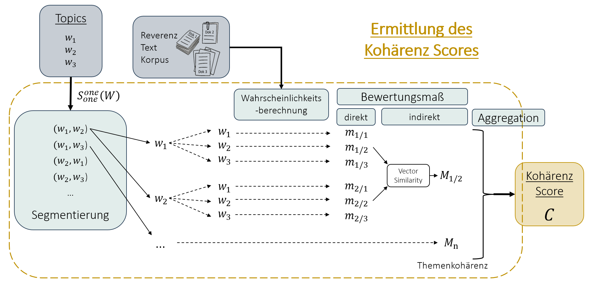
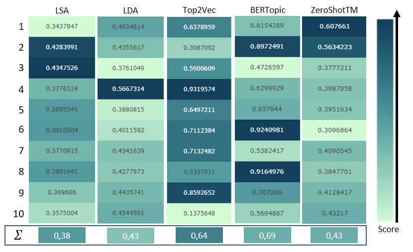
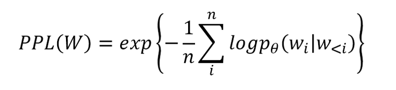
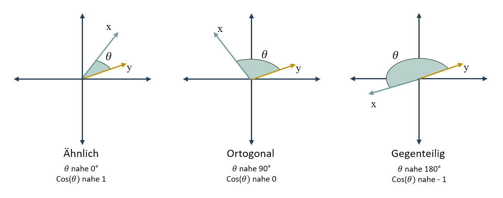
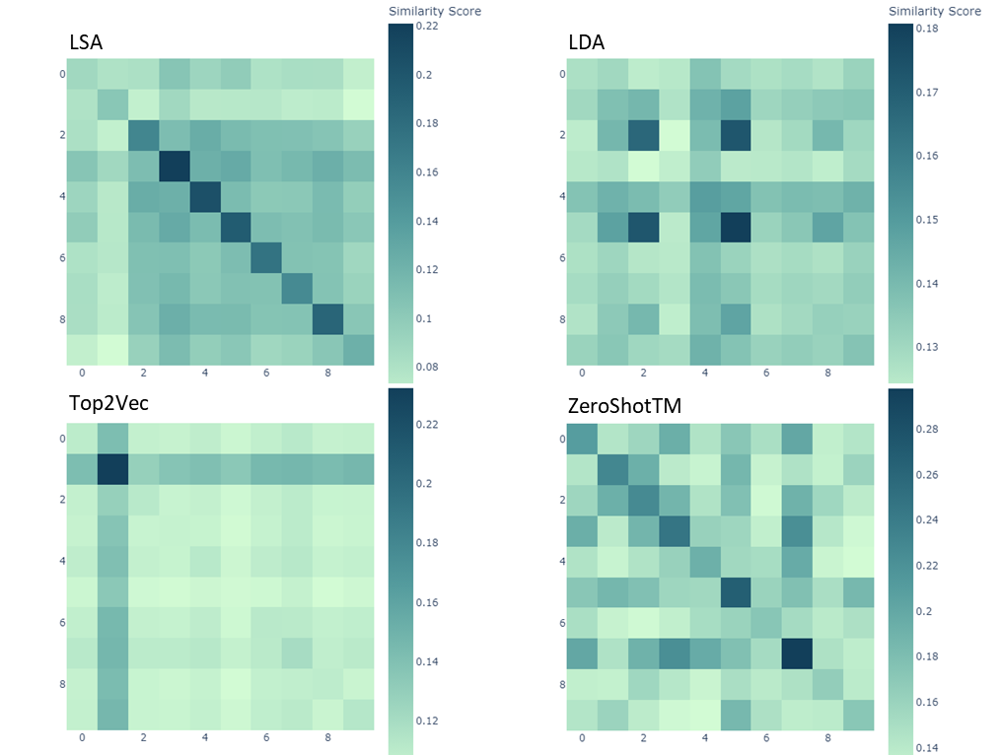

# Implementierung der Topic Modelling Modelle und deren empirische Evaluierung

In diesem Ordner des Github Repositorys sind die Notebooks der Implementierung und Evaluierung der fünf ausgewählten Topic Modelling Modelle. Da teilweise Probleme mit der Kompatibilität der verschiedenen Versionen von Libraries, welche für die einzelnen Modelle benötigt werden, aufgetreten sind, wurden diese in seperate Notebooks implementiert.

Für die Evaluierung wurden neben einem allgemeinen Vergleich der Vor- und Nachteile sowie einer qualitativen Untersuchung der Topics, drei Evaluierungsmetriken herangezogen:
1. Kohärenz
2. Perplexity
3. Similarity
   


## Kohärenz

### Theory
Die Kohärenz bezieht sich auf die semitische Verbundenheit von Wörtern, welche im Rahmen des Topic Modelling in Wortlisten gespeichert sind. Durch Sinnbeziehungen der Einheiten des Textes wirkt dieser auf den Leser semantisch konsistent und logisch (Rüdiger, Antons, Joshi, & Salge, 2022). Verallgemeinert gesagt ist eine Aussage kohärent, wenn sich die Inhalte gegenseitig stützen. Mithilfe von Themenkohärenzmaße lässt sich die Ähnlichkeit der Wörter in Bezug auf ein bestimmtes Thema messen (Kapadia, 2019). 
<p align="center">
  
</p>
<p align="center">Berechnung der des Kohärenzscores (Eigene Abbildung in Anlehnung an (Röder, Both, & Hinneburg, 2015, S. 5))</p>
<Br>

### Implementierung
```
coherence_model = CoherenceModel(topics     = topic_list, 
                                 texts      = token_list, 
                                 corpus     = corpus,
                                 dictionary = dictionary, 
                                 coherence  = 'c_v')
```
<Br>

### Ergebnisse
<p align="center">
  
</p>
<p align="center">Kohärenzen der Topic Modelling Modelle (Eigene Darstellung)</p>
<Br>


## Perplexity
### Theory
<p align="center">
  
</p>
<p align="center">...</p>
<Br>

### Implementierung
```
log_perplexity = -1 * np.mean(np.log(np.sum(probabilities, axis=1)))
perplexity = np.exp(log_perplexity)

```
<Br>

### Ergebnisse


<Br>

## Similarity
### Theory
<p align="center">
  
</p>
<p align="center">...</p>
<Br>

### Implementierung
```
similarity = cosine_similarity(doc_1, doc_2)
```
<Br>

### Ergebnisse
<p align="center">
  
</p>
<p align="center">...</p>
<Br>

## Literatur

