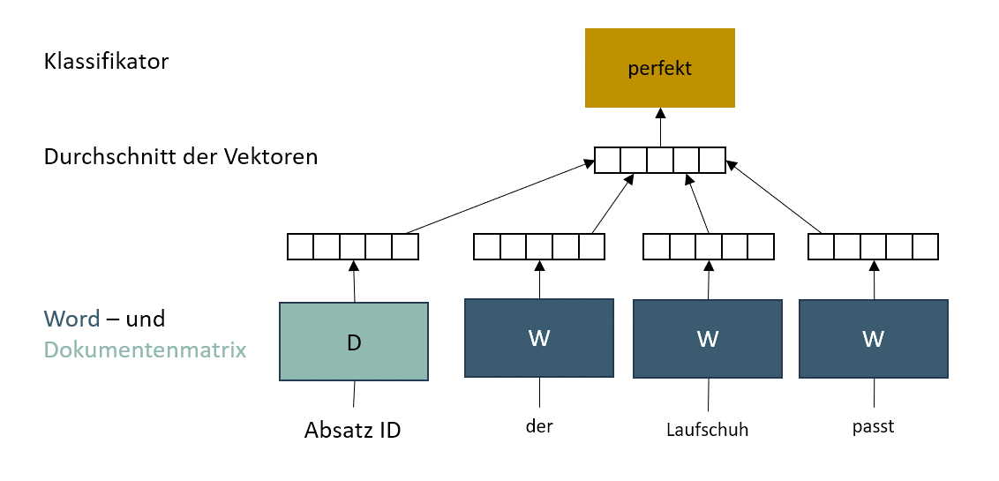
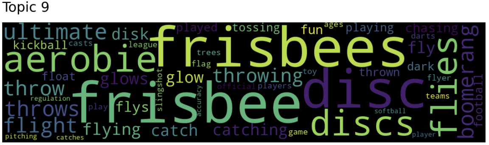

# Implementierung des Topic Modelling Modells: Top2Vec
Top2Vec ist ein modernerer Ansatz des Topic Modelling und gehört ebenfalls in den Bereich des unsupervised learning (Lande, 2022). Das Modell wurde 2020 von Dimo Angelov veröffentlicht und es ermöglicht, dem Anwender die komplexen Topic Modelling Algorithmen in lediglich einer Codezeile zu trainieren und auszuführen (Weng, 2020). Der Algorithmus erstellt Themenvektoren durch eine semitische Einbettung der Dokumente. Hierfür wird das "Doc2Vec" Verfahren herangezogen, welches eine Weiterentwicklung des „Word2Vec“ – Algorithmus darstellt. Dieser verwendet das Bag-of-Words-Modell “CBOW”, welches ein sogenanntes Schiebefenster um das zu betrachtende Wort zieht, um den Kontext des Wortes zu betrachten. Nach dem Training des Algorithmus wird das Wort dann von einem Merkmalsvektor zu einem Wordvektor. „Doc2Vec“ erweitert dieses Modell um einen zusätzlichen dokumentenspezifischen Merkmalsvektor, welcher auch unter dem Namen „Distributed Memory-Version of Paragraph Vector“ bekannt ist. Dieser Vektor ist sozusagen das Gedächtnis des Algorithmus, welches sich an den Kontext bzw. das Thema des Absatzes erinnert. Zusammenfassend lässt sich sagen, dass „Doc2Vec“ das Konzept der Wörter über den Wortvektor mit dem Kontext eines Dokuments über den Dokumentenvektor miteinander kombiniert und auf diese Weise die Semantik und Reihenfolge eines Textes berücksichtigt (Le & Mikolov, 2014, S. 3 f.)

<Br>
<p align="center">
  
</p>
<p align="center">Continuos Bag-of-Words-Modell erweitert um den Distributed Memory-Version of Paragraph Vector (Eigene Abbildung in Anlehnung an (Le & Mikolov, 2014, S. 3))</p>

<Br>

## Besonderheiten der Implementierung
Im Rahmen dieser Masterarbeit wurde die Implementierung eines Top2Vec Modelles mithilfe der [Library von Top2Vec](https://top2vec.readthedocs.io/en/stable/) selbstdurchgeführt. Die Implementierung ist hierfür im Folgenden aufgeführt:

```
# Insatlationen
%pip install top2vec
```
```
# Imports
from top2vec import Top2Vec
```

### __Intitialisierung und Training__
Top2Vec kann sehr einfach über lediglich eine Codezeile implementiert werden. Die Klasse des Modells wird initialisiert, indem die zu untersuchenden Texte diesem übergeben werden. Es werden dann automatisch Wortdokumenten Vektoren mithilfe von „doc2vec“ erstellt und die Dimensionsreduktion sowie das Clustering durchgeführt. Die Parameter sind hierbei vordefiniert, können jedoch über „umap_args“ und „hdbscan_args“ angepasst werden (Weng, 2020). 


```
model_top2vec = Top2Vec(sentence_list,                        # Liste der zu untersuchenden Texte
                        embedding_model = 'doc2vec',          # Verwendetes Embedding Model
                        min_count = 50,                       # Excludieren der Wörter, welche eine geringere Frequenz haben
                        umap_args=None,                       # Verwendung der Default Werte von UMAP
                        hdbscan_args=None,                    # Verwendung der Default Werte von HDBSCAN
                        verbose=True)                         # Progressbar
```
<Br>

## Ergebnisse
Top2Vec wählt aus den Gründen der Skalierbarkeit für große Datensätze und dem Erhalt der globalen sowie lokalen Strukturen UMAP. Um die Topics aus den Reviews in einem semantischen Raum zu extrahieren, wird HDBSACN als Clustering Algorithmus herangezogen. Dieses bildet dichte- und hierarchiebasierte Cluster und markiert alle Reviews, welche kein erkennbares zugrunde liegendes Thema aufweisen als Rauschen. Somit wird jedem Einbettungsvektor entweder ein Clusterlabel oder ein Rauschlabel zugeordnet (Angelov, 2020, S. 6-8). Die Ergebnisse dieser Clusteringanalyse für den Amazondatensatz wurde in einem 3D Scatterplot visuell veranschaulicht:
<Br>


<p align="center">Darstellung der Dimensionsreduktion und des Clustering von Top2Vec nach dem Embedding mit Doc2Vec (Eigene Darstellung)</p>
<Br>

### Repräsentative Wörter der Topics
Das Topic Modelling Modell gibt für jedes Topic eine Reihe repräsentativer Wörter aus, welche zur Interpreation der Themen dienen.

-	Topic 0: lasagna deliciozs tasty bland flavour
-	Topic 1: recommend price good quality overall
-	Topic 2: lansky stone sharpening stone strop
-	Topic 3: hatchet fiskars hatchets logs chopping
-	Topic 4: mirrors mirror mirrycle view traffic
-	Topic 5: mat xoga manduka mats jade poses studio
-	Topic 6: helmet helmets giro visor crash ventilator
-	Topic 7: elbow flexbar tennis tendonitis thera
-	Topic 8: coolers cooler igloo ice drinks yeti
-	Topic 9: frisbee frisbees disc aerobie discs

<Br>

Top2Vec bietet darüber hinaus zur Visualisierung eine einfache Implementierung einer Wordcloud an.
<p align="center">
  
</p>
<p align="center">Wordcloud zur Visualisierung der Topics (Eigene Darstellung)</p>
<Br>

## Literatur

Angelov, D. (19. 08 2020). TOP2VEC: DISTRIBUTED REPRESENTATIONS OF TOPICS. Abgerufen am 10. 07 2023 von https://arxiv.org/pdf/2008.09470.pdf

Lande, J. (29. 06 2022). Understanding Topic Modeling with Top2Vec. Abgerufen am 10. 07 2023 von medium.com: https://medium.com/@janhavil1202/understanding-topic-modeling-with-top2vec-cdf58bcd6c09

Le, Q., & Mikolov, T. (22. 05 2014). Distributed Representations of Sentences and Documents. Abgerufen am 11. 07 2023 von arxiv.org: https://arxiv.org/pdf/1405.4053.pdf

Weng, J. (21. 12 2020). Topic Modeling in One Line with Top2Vec. Abgerufen am 10. 07 2023 von towardsdatascience.com: https://towardsdatascience.com/topic-modeling-in-one-line-with-top2vec-a413991aa0ef

