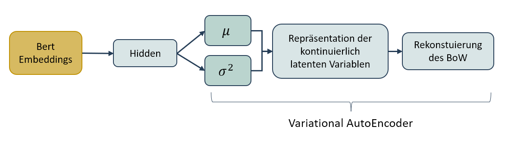
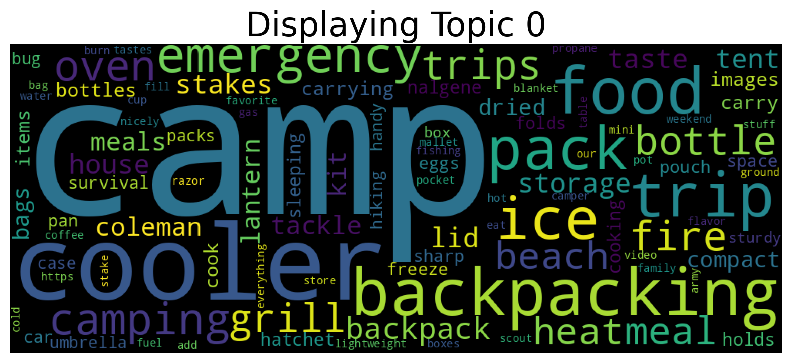

# Implementierung des Topic Modelling Modells: ZeroShotTM
Zero – Shot Topic Modelling ist wie BERTopic ein neuronales Themenmodell, welches sich der Problematik der Mehrsprachigkeit von Texten und dem Umgang mit fehlenden Worten im Korpus, wie es bei einem Bag of Words Ansatz vorkommen kann, befasst. Es ist eines der modernsten Ansätze in diesem Bereich und wurde 2020 in dem Paper „Cross-lingual Contextualized Topic Models with Zero-shot Learning“ von Bianchi und seinen Forschungskollegen vorgestellt. Die Besonderheit dieses Modells ist es, dass bereits bestehende Modell miteinander kombiniert werden, um Synergieeffekte zu erzeugen (Bianchi, Contextualized Topic Modeling with Python (EACL2021), 2021).

<Br>
<p align="center">
  
</p>
<p align="center">Architektur des ZeroShotTM (Eigene Darstellung in Anlehnung an (Bianchi, Terragni, Hovy, Nozza, & Fersini, 2020))</p>

<Br>

## Besonderheiten der Implementierung
Im Rahmen dieser Masterarbeit wurde die Implementierung eines ZeroShotTM Modelles mithilfe der [Library von ZeroSHotTM](https://github.com/MilaNLProc/contextualized-topic-models) selbst durchgeführt. Bevor die Implementierung von BERTopic beginnen kann, ist es hilfereich zur Beschleunigung der Prozesse des Embeddings und der Dimensionsreduktion PyTorch zu installieren. Auf diese Weise lässt sich mithilfe der NVIDIA-GPUs die Laufzeit um das bis zu 4,5 Fache beschleunigen (Grootendorst, Faster Topic Modeling with BERTopic and RAPIDS cuML, 2023).

Die Implementierung ist hierfür im Folgenden aufgeführt:

```
# Insatlationen
%pip install torch torchvision torchaudio --extra-index-url https://download.pytorch.org/whl/cu116
%pip install -U contextualized_topic_models
```
```
# Imports
import contextualized_topic_models
from contextualized_topic_models.utils.preprocessing import WhiteSpacePreprocessing
from contextualized_topic_models.models.ctm import ZeroShotTM
from contextualized_topic_models.utils.data_preparation import TopicModelDataPreparation
from contextualized_topic_models.utils.data_preparation import bert_embeddings_from_file
```

### __Intitialisierung__
Die vorverarbeiteten Embeddings enthalten die 2.000 Wörter, welche am häufigsten Auftreten. Auf diese Weise sollen wenig aussagekräftige Wörter entfernt werden, um den Trainingsprozess zu optimieren. Zur Initialisierung des Objekts wird die Länge des Vokabulars und und die Länge der Embedings aus „X_contextual“ übergeben. Über den Paramter „n_components“ kann festgelegt werden, wie viele Topics aus dem Modell generiert werden sollen. Ist dieser Parameter nicht gesetzt, so werden stets zehn Topics identifiziert (Bianchi, Contextualized Topic Modeling with Python (EACL2021), 2021).
```
zeroshot_model = ZeroShotTM(bow_size=len(embedding_model.vocab),
                            contextual_size=embeddings[1]["X_contextual"].shape[0])
```
<Br>

### __Anwendung des Modells__
Die Anwendung auf den Amazondatensatz erfolgt über ein "fit()" Funktion.
```
zeroshot_model.fit(embeddings)
```
<Br>

## Ergebnisse
Das Topic Modelling Modell gibt für jedes Topic eine Reihe repräsentativer Wörter aus, welche zur Interpreation der Themen dienen.

-	Topic 0: camp cooler backpacking food trip pack ice emergency camping oven
-	Topic 1: considered coat meaning micro drawback anyways factor http suspect afford
-	Topic 2: socks pants gloves pair her she balls wear shorts sock
-	Topic 3: was up so on to have in water it that
-	Topic 4: targets tings rifle sights 22 tires installed install bikes gun
-	Topic 5: delivery delivered thank shipped described expectations sign seller thanks
-	Topic 6: extreme scale internal admit entirely grade ensure lowest bending exception
-	Topic 7: is the this with it knife for be but as
-	Topic 8: whistle disc bass chalk trout flies lure stopwatch therapy frisbee
-	Topic 9: considered complained meaning drawback sat admit factor search suspect

<Br>

ZeroShotTM bietet darüber hinaus zur Visualisierung eine einfache Implementierung einer Wordcloud an.
<p align="center">
  
</p>
<p align="center">Wordcloud zur Visualisierung der Topics (Eigene Darstellung)</p>
<Br>

## Literatur

Bianchi, F. (11. 02 2021). Contextualized Topic Modeling with Python (EACL2021). Abgerufen am 30. 07 2023 von towardsdatascience.com: https://towardsdatascience.com/contextualized-topic-modeling-with-python-eacl2021-eacf6dfa576

Grootendorst, M. (19. 01 2023). Faster Topic Modeling with BERTopic and RAPIDS cuML. Abgerufen am 02. 08 2023 von medium.com: https://medium.com/rapids-ai/faster-topic-modeling-with-bertopic-and-rapids-cuml-5c7559aba898

